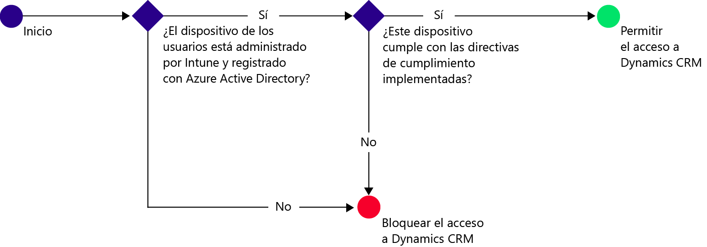
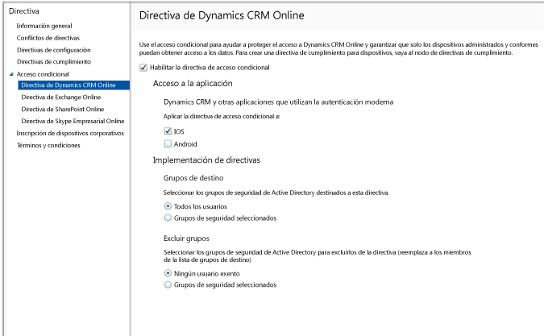

# Proteger el acceso a Dynamics CRM Online con Intune

[!INCLUDE[classic-portal](../includes/classic-portal.md)]

Puede controlar el acceso a Microsoft Dynamics CRM Online desde los dispositivos de iOS y Android con el acceso condicional de Microsoft Intune.  El acceso condicional de Intune tiene dos componentes:
* La [directiva de cumplimiento del dispositivo](introduction-to-device-compliance-policies-in-microsoft-intune.md), con la que debe cumplir el dispositivo para que se considere conforme.
* La [directiva de acceso condicional](restrict-access-to-email-and-o365-services-with-microsoft-intune.md), donde se especifican las condiciones que debe cumplir el dispositivo para tener acceso al servicio.

Para obtener más información sobre cómo funciona el acceso condicional, lea el artículo [Proteger el acceso al correo electrónico, a O365 y a otros servicios](restrict-access-to-email-and-o365-services-with-microsoft-intune.md).

> [!IMPORTANT]
> Para implementar el acceso condicional debe tener suscripciones a Intune y Azure Active Directory Premium, y los usuarios deben tener la licencia de ambos productos. La **suscripción a Enterprise Mobility + Security (EMS)** incluye suscripciones a Intune y Azure Active Directory Premium. Para obtener más información, consulte la [página de precios de Enterprise Mobility](https://www.microsoft.com/cloud-platform/enterprise-mobility-pricing). Si no tiene la suscripción de EMS, puede obtener una para Azure Active Directory Premium. Consulte la [página de precios de Azure Active Directory](https://azure.microsoft.com/pricing/details/active-directory/).

Cuando un usuario determinado intenta usar la aplicación Dynamics CRM en su dispositivo, se produce la siguiente evaluación:

El dispositivo que necesita tener acceso a Dynamics CRM Online debe:
* Ser un dispositivo **Android** o **iOS**.
* **Estar inscrito** con Intune.
* **Cumplir** todas las directivas de cumplimiento de Intune implementadas.

El estado del dispositivo se almacena en Azure Active Directory, que concede o bloquea el acceso según las condiciones especificadas.

Si no se cumple una condición, se presentará al usuario uno de los mensajes siguientes cuando inicie sesión:
* Si el dispositivo no está inscrito con Intune, o registrado en Azure Active Directory, se muestra un mensaje con instrucciones sobre cómo instalar la aplicación de portal de empresa e inscribirse.
* Si el dispositivo no es compatible, se muestra un mensaje que dirige al usuario al sitio web de portal de empresa de Microsoft Intune o a la aplicación de portal de empresa, donde puede encontrar información sobre el problema y sobre cómo resolverlo.

## Configurar un acceso condicional para Dynamics CRM Online  
### Paso 1: Configurar grupos de seguridad de Active Directory

Antes de empezar, configure los grupos de seguridad de Azure Active Directory para la directiva de acceso condicional. Estos grupos se pueden configurar en el **Centro de administración de Office 365**. Use estos grupos para aplicar la directiva a los usuarios o para excluirlos de ella. Cuando un usuario es destinatario de una directiva, cada dispositivo que use debe ser conforme con el fin de obtener acceso a los recursos.

Puede especificar dos tipos de grupos para usarlos con la directiva de Dynamics CRM:
* **Grupos destinatarios**. Contiene grupos de usuarios a los que se aplica la directiva.
* **Grupos exentos**. Contiene grupos de usuarios que están exentos de la directiva.

Si un usuario pertenece a ambos grupos, estará exento de la directiva.

### Paso 2: Configurar e implementar una directiva de cumplimiento
[Cree](create-a-device-compliance-policy-in-microsoft-intune.md) una directiva de cumplimiento e [impleméntela](deploy-and-monitor-a-device-compliance-policy-in-microsoft-intune.md) en todos los dispositivos que se verán afectados por la directiva. Estos dispositivos serán los que usen los usuarios de los Grupos de destino.

> [!NOTE]
> Mientras se implementan las directivas de cumplimiento en los grupos de Intune, las directivas de acceso condicional se aplican a los grupos de seguridad de Azure Active Directory.

> [!IMPORTANT]
> Si no ha implementado una directiva de cumplimiento, los dispositivos se considerarán no conformes.

Cuando esté listo, continúe en el paso 3.
### Paso 3: Configurar la directiva de Dynamics CRM
A continuación, configure la directiva para requerir que solo los dispositivos administrados y compatibles puedan tener acceso a Dynamics CRM. Esta directiva se almacenará en Azure Active Directory.

1.  En la consola de administración de Intune, elija **Directiva > Acceso condicional > Directiva de Dynamics CRM Online**.

  

2.  Elija **Habilitar la directiva de acceso condicional**.
3.  En **Acceso a la aplicación**, puede elegir aplicar la directiva de acceso condicional a:
  * **iOS**
  * **Android**
4.  En **Grupos de destino**, seleccione **Modificar** para seleccionar los grupos de seguridad de Azure Active Directory a los que se aplicará la directiva. Puede elegir aplicarla a todos los usuarios o solo a un grupo específico de usuarios.
5.    En **Grupos exentos**, opcionalmente, elija **Modificar** para seleccionar los grupos de seguridad de Azure Active Directory exentos de esta directiva.
6.    Cuando termine, elija **Guardar**.

Acaba de configurar el acceso condicional para Dynamics CRM. No es necesario implementar la directiva de acceso condicional, ya que surte efecto inmediatamente.
##  Supervisar el cumplimiento y las directivas de acceso condicional

En el área de trabajo **Grupos** , puede ver el estado de acceso condicional de los dispositivos.

Elija cualquier grupo de dispositivos móviles y, a continuación, en la ficha **Dispositivos**, elija uno de los siguientes **Filtros**:
* **Dispositivos no registrados en AAD**. Estos dispositivos están bloqueados en Dynamics CRM.
* **Dispositivos no conformes**. Estos dispositivos están bloqueados en Dynamics CRM.
* **Dispositivos registrados en AAD y conformes**. Estos dispositivos pueden tener acceso a Dynamics CRM.

##  Pasos siguientes
* [Proteger el acceso a Exchange Online](restrict-access-to-exchange-online-with-microsoft-intune.md)

* [Proteger el acceso a Exchange local](restrict-access-to-exchange-onpremises-with-microsoft-intune.md)
* [Proteger el acceso a SharePoint Online](restrict-access-to-sharepoint-online-with-microsoft-intune.md)

* [Proteger el acceso a Skype Empresarial Online](restrict-access-to-skype-for-business-online-with-microsoft-intune.md)

