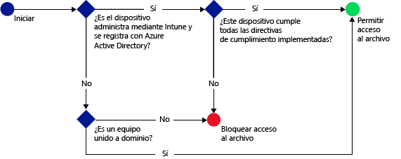

# Restringir el acceso a SharePoint Online con Microsoft Intune
Use el acceso condicional de [!INCLUDE[wit_firstref](../includes/wit_firstref_md.md)] para controlar el acceso a los archivos que se encuentran en SharePoint Online.
El acceso condicional tiene dos componentes:
- Una directiva de cumplimiento del dispositivo con la que debe cumplir el dispositivo para que se considere conforme.
- Una directiva de acceso condicional, donde se especifican las condiciones que debe cumplir el dispositivo para tener acceso al servicio.
Para más información sobre cómo funciona el acceso condicional, consulte el tema [Restringir el acceso al correo electrónico, a O365 y a otros servicios](restrict-access-to-email-and-o365-services-with-microsoft-intune.md).

Debe implementar las directivas de acceso condicional y cumplimiento en los usuarios. Cualquier dispositivo que un usuario use para tener acceso a los servicios se somete a comprobaciones para comprobar que cumple con las directivas.

Cuando un usuario intenta conectarse a un archivo mediante una aplicación compatible como OneDrive en su dispositivo, se produce la siguiente evaluación:

**Antes** de configurar una directiva de acceso condicional para SharePoint Online, debe:
- Tener una **suscripción de SharePoint Online** y los usuarios deben tener licencia para SharePoint Online.
- Tener una **suscripción de Enterprise Mobility + Security (EMS)** o una **suscripción de Azure Active Directory (Azure AD) Premium** y los usuarios deben tener la licencia de EMS o Azure AD. Para obtener más detalles, vea la [página de precios de Enterprise Mobility](https://www.microsoft.com/en-us/cloud-platform/enterprise-mobility-pricing) o la [página de precios de Azure Active Directory](https://azure.microsoft.com/en-us/pricing/details/active-directory/).

  Para conectarse a los archivos requeridos, un dispositivo debe:
-   Estar **inscrito** con [!INCLUDE[wit_nextref](../includes/wit_nextref_md.md)] o ser un equipo unido a un dominio.

-   Estar **registrado** en Azure Active Directory, lo que se lleva a cabo automáticamente si el dispositivo está inscrito con [!INCLUDE[wit_nextref](../includes/wit_nextref_md.md)].

-   **Cumplir** con las directivas de cumplimiento de [!INCLUDE[wit_nextref](../includes/wit_nextref_md.md)] implementadas.

El estado del dispositivo se almacena en Azure Active Directory, que concede o bloquea el acceso a los archivos según las condiciones que especifica.

Si no se cumple una condición, el usuario ve uno de los mensajes siguientes cuando inicie sesión:

-   Si el dispositivo no está inscrito con [!INCLUDE[wit_nextref](../includes/wit_nextref_md.md)] o si no está registrado en Azure Active Directory, se muestra un mensaje con instrucciones sobre cómo instalar la aplicación Portal de empresa e inscribirse.

-   Si el dispositivo no es conforme, se muestra un mensaje que dirige al usuario al sitio web del Portal de empresa de [!INCLUDE[wit_nextref](../includes/wit_nextref_md.md)], donde encontrará información sobre el problema y sobre cómo resolverlo.

**El acceso condicional no se aplica al uso compartido externo**. Para información sobre cómo impedir el uso compartido externo en el inquilino o una colección de sitios, consulte [Administrar el uso compartido externo en su entorno de SharePoint Online](https://support.office.com/en-us/article/Manage-external-sharing-for-your-SharePoint-Online-environment-C8A462EB-0723-4B0B-8D0A-70FEAFE4BE85?ui=en-US&rs=en-US&ad=US).

>[!NOTE]
>Si habilita el acceso condicional para SharePoint Online, se recomienda que deshabilite el dominio en la lista como se describe en el tema [Remove-SPOTenantSyncClientRestriction](https://technet.microsoft.com/en-us/library/dn917451.aspx).  

## Compatibilidad con dispositivos móviles
No se admite lo siguiente:
- iOS 8.0 y versiones posteriores
- Android 4.0 y versiones posteriores, Samsung Knox Standard 4.0 o versiones posteriores
- Windows Phone 8.1 y versiones posteriores

Puede restringir el acceso a SharePoint Online cuando dispositivos **iOS** y **Android** obtengan acceso a él desde un explorador. Solo se permite el acceso desde exploradores compatibles en dispositivos que también lo sean:
* Safari (iOS)
* Chrome (Android)
* Intune Managed Browser (iOS y Android 5.0 y posterior)

**Los exploradores no compatibles están bloqueados**.

## Compatibilidad para equipos
No se admite lo siguiente:
- Windows 8.1 y versiones posteriores (cuando los equipos están inscritos en Intune).
- Windows 7.0, Windows 8.1 o Windows 10 (cuando los equipos están unidos a un dominio).
> [!NOTE]
>Para usar el acceso condicional con equipos Windows 10, debe actualizarlos con la Actualización de aniversario de Windows 10.

  - Debe configurar los equipos unidos a un dominio para que [se registren automáticamente](https://azure.microsoft.com/en-us/documentation/articles/active-directory-conditional-access-automatic-device-registration/) con Azure Active Directory. El servicio Registro de dispositivos de Azure AD se activará automáticamente para los clientes de Intune y Office 365. Los clientes que ya hayan implementado el servicio Registro de dispositivos de ADFS no podrán ver los dispositivos registrados en la instancia local de Active Directory.

  - Si la directiva está establecida para requerir la unión a un dominio y el equipo no está unido a ningún dominio, se muestra un mensaje que indica que es necesario ponerse en contacto con el administrador de TI.

  - Si la directiva está establecida para requerir la unión a un dominio o el cumplimiento y el equipo no cumple estos requisitos, se muestra un mensaje con instrucciones sobre cómo instalar la aplicación Portal de empresa e inscribirse.
  >[!NOTE]
  >No se admite el acceso condicional en los equipos que ejecutan el cliente del equipo de Intune.

[La autenticación moderna de Office 365 debe estar habilitada](https://support.office.com/en-US/article/Using-Office-365-modern-authentication-with-Office-clients-776c0036-66fd-41cb-8928-5495c0f9168a) y tener las actualizaciones más recientes de Office.

La autenticación moderna aporta inicio de sesión basado en la biblioteca de autenticación de Active Directory (ADAL) para los clientes de Windows en Office 2013 y habilita una mejor seguridad como la **autenticación multifactor** y la **autenticación basada en certificados**.

## Configurar el acceso condicional de SharePoint Online

### Paso 1: Configurar grupos de seguridad de Active Directory
Antes de empezar, configure los grupos de seguridad de Azure Active Directory para la directiva de acceso condicional. Estos grupos se pueden configurar en el **Centro de administración de Office 365**o en el **portal de cuentas de Intune**. Use estos grupos para aplicar la directiva a los usuarios o para excluirlos de ella. Cuando un usuario es destinatario de una directiva, cada dispositivo que use debe ser conforme a fin de obtener acceso a los recursos.

Se pueden especificar dos tipos de grupo en una directiva de SharePoint Online:

-   **Grupos de destino**: contiene grupos de usuarios a los que se aplica la directiva.

-   **Grupos exentos**: contiene grupos de usuarios que están exentos de la directiva.

Si un usuario pertenece a ambos grupos, estará exento de la directiva.

### Paso 2: Configurar e implementar una directiva de cumplimiento
Si todavía no lo ha hecho, cree una directiva de cumplimiento e impleméntela para todos los usuarios a los que se dirige la directiva de SharePoint Online.

> [!NOTE]
> Mientras se implementan las directivas de cumplimiento en los grupos de [!INCLUDE[wit_nextref](../includes/wit_nextref_md.md)], las directivas de acceso condicional se aplican a los grupos de seguridad de Azure Active Directory.

Para más información sobre cómo configurar la directiva de cumplimiento, consulte [Crear una directiva de cumplimiento](create-a-device-compliance-policy-in-microsoft-intune.md).

> [!IMPORTANT]
> Si no ha implementado una directiva de cumplimiento, los dispositivos se consideran conformes.

Cuando esté listo, continúe en el **paso 3**.

### Paso 3: Configurar la directiva de SharePoint Online
A continuación, configure la directiva para requerir que solo los dispositivos administrados y conformes puedan tener acceso a SharePoint Online. Esta directiva se almacena en Azure Active Directory.

#### 

>[!NOTE]
> También puede crear una directiva de acceso condicional para dispositivos Intune en la consola de administración de Azure AD (la directiva se conoce como la **directiva de acceso condicional basado en dispositivo** en Azure AD). Además, puede crear otras directivas de acceso condicional, como la autenticación multifactor. También puede establecer directivas de acceso condicional para aplicaciones empresariales de terceros compatibles con Azure AD, como Salesforce y Box. Para obtener más información, consulte [Establecimiento de una directiva de acceso condicional basado en dispositivos de Azure Active Directory para el control de acceso a aplicaciones conectadas a Azure Active Directory](https://azure.microsoft.com/en-us/documentation/articles/active-directory-conditional-access-policy-connected-applications/).

1.  En la [consola de administración de Microsoft Intune](https://manage.microsoft.com), seleccione **Directiva** > **Acceso condicional** > **Directiva de SharePoint Online**.

2.  Seleccione **Habilitar directiva de acceso condicional para SharePoint Online**.

3.  En **Acceso a la aplicación**, puede elegir aplicar la directiva de acceso condicional a:

    -   **Todas las plataformas**

        Esto requiere que cualquier dispositivo usado para obtener acceso a **SharePoint Online** se inscriba en Intune y cumpla las directivas. Cualquier aplicación cliente que use la **autenticación moderna** estará sujeta a la directiva de acceso condicional. Si la plataforma no es compatible actualmente con Intune, el acceso a **SharePoint Online** se bloqueará.

        Seleccionar la opción **Todas las plataformas** significa que Azure Active Directory aplica esta directiva a todas las solicitudes de autenticación, independientemente de la plataforma notificada por la aplicación cliente. Todas las plataformas tienen que inscribirse y ser compatibles, excepto:
        *   Los dispositivos Windows, que deben estar inscritos y ser compatibles, estar unidos a dominio con Active Directory local, o ambos.
        * Plataformas no compatibles como Mac. Por el contrario, las aplicaciones que usan autenticación moderna que proceden de estas plataformas seguirán bloqueadas.

    -   **Plataformas específicas**

         La directiva de acceso condicional se aplica a cualquier aplicación cliente que use la autenticación moderna en las plataformas que especifique.

     En el caso de los equipos de Windows, un equipo debe estar unido a un dominio o inscrito con [!INCLUDE[wit_nextref](../includes/wit_nextref_md.md)] y ser conforme. Puede establecer los requisitos siguientes:

     -   **Los dispositivos deben estar unidos a un dominio o ser conformes.** Elija esta opción para requerir que el equipo esté unido al dominio o que cumpla las directivas establecidas en [!INCLUDE[wit_nextref](../includes/wit_nextref_md.md)]. Si un equipo no cumple alguno de estos requisitos, se le solicita al usuario que inscriba el dispositivo en [!INCLUDE[wit_nextref](../includes/wit_nextref_md.md)].

     -   **Los dispositivos deben estar unidos a un dominio.** Elija esta opción para requerir que los equipos estén unidos al dominio para tener acceso a Exchange Online. Si el equipo no está unido a un dominio, el acceso al correo electrónico se bloquea y el usuario debe ponerse en contacto con el administrador de TI.

     -   **Los dispositivos deben ser conformes.** Elija esta opción para requerir que los equipos estén inscritos en [!INCLUDE[wit_nextref](../includes/wit_nextref_md.md)] y sean conformes. Si el equipo no está inscrito, se muestra un mensaje con instrucciones sobre cómo inscribirse.

4.   En **Acceso al explorador** en SharePoint Online y OneDrive para la Empresa, puede permitir el acceso a Exchange Online solo a través de los exploradores admitidos: Safari (iOS) y Chrome (Android). El acceso desde otros exploradores está bloqueado. Las mismas restricciones de plataforma que seleccionó para el acceso a la aplicación OneDrive también se aplican aquí.

  En los dispositivos **Android**, los usuarios deben habilitar el acceso al explorador. Para ello, un usuario debe elegir la opción **Habilitar acceso al explorador** en el dispositivo inscrito de este modo:
  1.    Abra la aplicación **Portal de empresa**.
  2.    Vaya a la página **Configuración** desde los tres puntos (...) o desde el botón del menú de hardware.
  3.    Pulse el botón **Habilitar acceso al explorador**.
  4.    En el explorador Chrome, cierre la sesión de Office 365 y reinicie Chrome.

  En las plataformas **iOS** y **Android**, para identificar el dispositivo que se usa para obtener acceso al servicio, Azure Active Directory emite un certificado de seguridad de la capa de transporte (TLS) para el dispositivo. El dispositivo muestra el certificado en una petición para que el usuario final lo seleccione, como se muestra en las capturas de pantalla siguientes. El usuario debe seleccionar este certificado para poder usar el explorador.

  **iOS**

  

  **Android**

  
5.  En **Grupos de destino**, elija **Modificar** para seleccionar los grupos de seguridad de Azure Active Directory a los que se aplica la directiva. Puede elegir aplicarla a todos los usuarios o solo a un grupo específico de usuarios.

6.  En **Grupos exentos**, opcionalmente, elija **Modificar** para seleccionar los grupos de seguridad de Azure Active Directory exentos de esta directiva.

7.  Cuando termine, elija **Guardar**.

No es necesario implementar la directiva de acceso condicional, ya que surte efecto inmediatamente.

### Paso 4: Supervisar el cumplimiento y las directivas de acceso condicional
En el área de trabajo **Grupos**, puede ver el estado de los dispositivos.

Seleccione cualquier grupo de dispositivos móviles. Luego, en la pestaña **Dispositivos**, elija uno de los siguientes **Filtros**:

-   **Dispositivos no registrados en AAD**. Estos dispositivos están bloqueados en SharePoint Online.

-   **Dispositivos no conformes**. Estos dispositivos están bloqueados en SharePoint Online.

-   **Dispositivos registrados en AAD y conformes**. Estos dispositivos pueden tener acceso a SharePoint Online.

### Consulte también
[Restringir el acceso al correo electrónico y a los servicios de O365 con Microsoft Intune](restrict-access-to-email-and-o365-services-with-microsoft-intune.md)

<!--HONumber=Dec16_HO2-->

