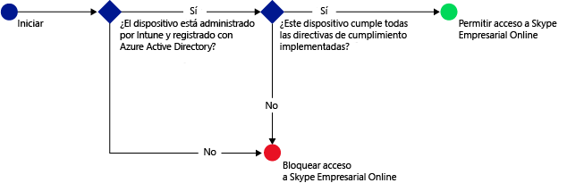

# Proteger el acceso a Skype Empresarial Online con Microsoft Intune

[!INCLUDE[classic-portal](../includes/classic-portal.md)]

Puede usar una directiva de acceso condicional para **Skype Empresarial Online** a fin de controlar el acceso a Skype Empresarial Online.
El acceso condicional tiene dos componentes:
- Una directiva de cumplimiento del dispositivo con la que debe cumplir el dispositivo para que se considere conforme.
- Una directiva de acceso condicional, donde se especifican las condiciones que debe cumplir el dispositivo para que tenga acceso al servicio.
Para más información sobre cómo funciona el acceso condicional, consulte el artículo [Proteger el acceso al correo electrónico y los servicios de O365](restrict-access-to-email-and-o365-services-with-microsoft-intune.md).

Cuando un usuario determinado intenta usar Skype Empresarial Online en su dispositivo, se produce la siguiente evaluación:

**Antes** de configurar una directiva de acceso condicional para Skype Empresarial Online, debe:
- Tener una **suscripción de Skype Empresarial Online** y asignar la licencia de Skype Empresarial Online a los usuarios.
- Tener una **suscripción de Enterprise Mobility + Security (EMS)** o una **suscripción de Azure Active Directory (Azure AD) Premium** y que los usuarios tengan licencia de EMS o Azure AD. Para más detalles, consulte los [precios de Enterprise Mobility](https://www.microsoft.com/en-us/cloud-platform/enterprise-mobility-pricing) o los [precios de Azure Active Directory](https://azure.microsoft.com/en-us/pricing/details/active-directory/).

-   [Habilitar la autenticación moderna](https://docs.microsoft.com/en-us/intune/deploy-use/restrict-access-to-skype-for-business-online-with-microsoft-intune) para Skype Empresarial Online.
-  Todos los usuarios deben usar **Skype Empresarial Online**. Si tiene una implementación con Skype Empresarial Online y Skype Empresarial local, la directiva de acceso condicional no se aplicará a los usuarios.

El dispositivo que necesita tener acceso a Skype Empresarial Online:

-   Debe ser un dispositivo **Android** o **iOS**.

-   Debe estar **inscrito** con [!INCLUDE[wit_nextref](../includes/wit_nextref_md.md)].

-   Debe **cumplir** todas las directivas de cumplimiento de [!INCLUDE[wit_nextref](../includes/wit_nextref_md.md)] implementadas.

El estado del dispositivo se almacena en Azure Active Directory, que concede o bloquea el acceso según las condiciones especificadas.

Si no se cumple una condición, se presentará al usuario uno de los mensajes siguientes cuando inicie sesión:

-   Si el dispositivo no está inscrito con [!INCLUDE[wit_nextref](../includes/wit_nextref_md.md)] o si no está registrado en Azure Active Directory, se muestra un mensaje con instrucciones sobre cómo instalar la aplicación Portal de empresa e inscribirse.

-   Si el dispositivo no es conforme, se muestra un mensaje que dirige al usuario a la aplicación de portal de empresa o al sitio web del portal de empresa de [!INCLUDE[wit_nextref](../includes/wit_nextref_md.md)], donde puede encontrar información sobre el problema y sobre cómo corregirlo.

## Configurar el acceso condicional para Skype Empresarial Online

### Paso 1: Configurar grupos de seguridad de Azure Active Directory
Antes de empezar, configure los grupos de seguridad de Azure Active Directory para la directiva de acceso condicional. Estos grupos se pueden configurar en el **Centro de administración de Office 365**. Estos grupos se usarán para aplicar la directiva a los usuarios o para excluirlos de ella. Cuando un usuario es destinatario de la directiva, cada dispositivo que use debe ser conforme con el fin de obtener acceso a los recursos.

Puede especificar dos tipos de grupos para la directiva de Skype Empresarial:

-   **Grupos de destino**: contiene grupos de usuarios a los que se aplica la directiva.

-   **Grupos exentos**: contiene grupos de usuarios que están exentos de la directiva.

Si un usuario pertenece a ambos grupos, estará exento de la directiva.

### Paso 2: Configurar e implementar una directiva de cumplimiento
[Cree](create-a-device-compliance-policy-in-microsoft-intune.md) e [implemente](deploy-and-monitor-a-device-compliance-policy-in-microsoft-intune.md) una directiva de cumplimiento para todos los dispositivos que se verán afectados por la directiva. Dichos dispositivos serán los que usen los usuarios de los **Grupos de destino**.

> [!NOTE]
> Mientras se implementan las directivas de cumplimiento en los grupos de [!INCLUDE[wit_nextref](../includes/wit_nextref_md.md)], las directivas de acceso condicional se aplican a los grupos de seguridad de Azure Active Directory.

> [!IMPORTANT]
> Si no ha implementado una directiva de cumplimiento, los dispositivos se considerarán conformes.

Cuando esté listo, continúe en el **paso 3**.

### Paso 3: Configurar la directiva de Skype Empresarial Online
Después, configure la directiva para requerir que solo los dispositivos administrados y conformes puedan tener acceso a Skype Empresarial Online. Esta directiva se almacenará en Azure Active Directory.

1.  En la [consola de administración de Microsoft Intune](https://manage.microsoft.com), elija **Directiva** > **Acceso condicional** > **Directiva de Skype Empresarial Online**.

  

2.  Elija **Habilitar la directiva de acceso condicional**.

3.  En **Acceso a la aplicación**, puede elegir aplicar la directiva de acceso condicional a:

    -   **iOS**

    -   **Android**

4.  En **Grupos de destino**, seleccione **Modificar** para seleccionar los grupos de seguridad de Azure Active Directory a los que se aplicará la directiva. Puede elegir aplicarla a todos los usuarios o solo a un grupo específico de usuarios.

5.  En **Grupos exentos**, opcionalmente, elija **Modificar** para seleccionar los grupos de seguridad de Azure Active Directory exentos de esta directiva.

6.  Cuando termine, elija **Guardar**.

Acaba de configurar el acceso condicional para Skype Empresarial Online. No es necesario implementar la directiva de acceso condicional, ya que surte efecto inmediatamente.

## Supervisar el cumplimiento y las directivas de acceso condicional
En el área de trabajo **Grupos** , puede ver el estado de acceso condicional de los dispositivos.

Seleccione cualquier grupo de dispositivos móviles. Luego, en la pestaña **Dispositivos**, elija uno de los siguientes **Filtros**:

* **Dispositivos no registrados en AAD**: estos dispositivos están bloqueados en Skype Empresarial Online.

* **Dispositivos no conformes**: estos dispositivos están bloqueados en Skype Empresarial Online.

* **Dispositivos registrados en AAD y conformes**: estos dispositivos pueden tener acceso a Skype Empresarial Online.

<!--HONumber=Jan17_HO1-->

