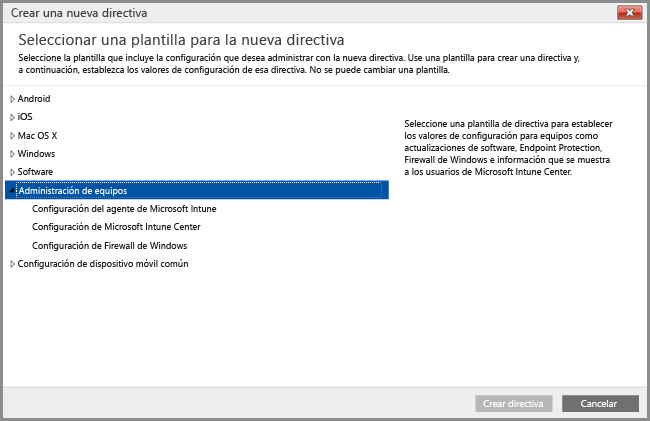

# Usar directivas para simplificar la administración de PC de Windows

Para administrar escritorios de Windows como PC, ejecutando el cliente de software de Intune en ellos, solo puede usar las directivas que se encuentran en las directivas de **Administración de equipos** de la consola de administración de Intune. Todas las demás directivas que aparecen en la consola de administración son solo para dispositivos móviles. Al usar las directivas de **Administración de equipos** puede configurar las opciones en Microsoft Intune Center, controlar las actualizaciones en PC y configurar Firewall de Windows para PC.

### Administrar Microsoft Intune Center
Los usuarios ven el cliente de software de Intune como **Microsoft Intune Center**. Con Microsoft Intune Center se puede hacer lo siguiente:

-   Obtener aplicaciones desde el portal de empresa.

-   Comprobar si hay actualizaciones.

-   Administrar Microsoft Intune Endpoint Protection.

-  Solicitar asistencia remota.

Microsoft Intune Center se instala en todos los equipos administrados. En una directiva de Intune se pueden establecer las siguientes opciones de configuración, que se mostrarán a los usuarios en Microsoft Intune Center:

|Configuración de directiva|Detalles|
|------------------|--------------------|
|**Nombre**|El nombre del administrador del equipo. Longitud máxima: 40 caracteres|
|**Número de teléfono**|El número de teléfono del administrador del equipo. Longitud máxima: 20 caracteres|
|**Dirección de correo electrónico**|La dirección de correo electrónico del administrador del equipo. Longitud máxima: 40 caracteres|
|**Nombre del sitio web**|El nombre del sitio web de soporte para los usuarios. >Longitud máxima: 40 caracteres|
|**Dirección URL del sitio web**|La dirección URL del sitio web de soporte. Longitud máxima: 150 caracteres|
|**Notas**|Una nota que se muestra a los usuarios. Longitud máxima: 120 caracteres|

Consulte los siguientes recursos para obtener información sobre las directivas y las opciones que puede configurar para equipos Windows:

- [Mantener los equipos Windows al día con las actualizaciones de software de Microsoft Intune](keep-windows-pcs-up-to-date-with-software-updates-in-microsoft-intune.md): estas directivas hacen que los equipos administrados busquen y descarguen actualizaciones de software de Microsoft y de terceros. No se incluyen las actualizaciones de sistema operativo (por ejemplo, actualizaciones de Windows 7 a Windows 10 o actualizaciones de una versión de Windows 10 a una versión posterior).

- [Ayudar a proteger los equipos de Windows con Endpoint Protection para Microsoft Intune](help-secure-windows-pcs-with-endpoint-protection-for-microsoft-intune.md): en estas opciones de configuración se incluye la programación de exámenes y las acciones que se deben realizar cuando se detecta software malintencionado.

- [Ayudar a proteger los equipos de Windows mediante directivas del Firewall de Windows en Microsoft Intune](help-protect-windows-pcs-using-windows-firewall-policies-in-microsoft-intune.md): estas directivas simplifican la administración de la configuración de Firewall de Windows en los equipos administrados.

### Consulte también

[Tareas comunes de administración de equipos Windows con el cliente de software de Intune](common-windows-pc-management-tasks-with-the-microsoft-intune-computer-client.md)

<!--HONumber=Dec16_HO3-->

