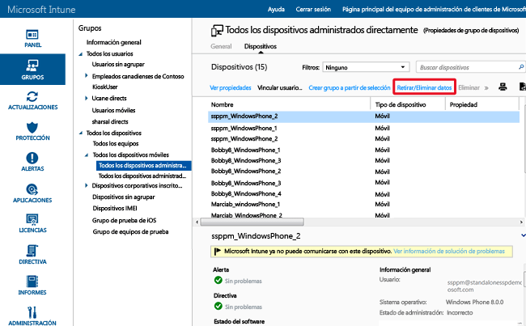

# Ayudar a proteger los datos con el borrado selectivo o completo mediante Microsoft Intune

[!INCLUDE[classic-portal](../includes/classic-portal.md)]

Puede borrar las aplicaciones y datos de los dispositivos administrados por Intune que ya no son necesarios, se van a reutilizar o han desaparecido. Para hacer esto, Intune proporciona funcionalidades de borrado completo y de borrado selectivo. Los usuarios también pueden emitir un comando de borrado remoto de dispositivos desde el portal de empresa de Intune en dispositivos de propiedad privada inscritos en Intune.

  > [!NOTE]
  > En este tema se trata únicamente el borrado de dispositivos administrados mediante la administración de dispositivos móviles de Intune. También puede usar [Azure Portal](https://portal.azure.com) para [eliminar datos corporativos de las aplicaciones](wipe-managed-company-app-data-with-microsoft-intune.md). También puede [retirar los equipos administrados con software cliente de Intune](retire-a-windows-pc-with-microsoft-intune.md).

## Borrar todos los datos

La opción **Borrar todos los datos** restaura la configuración predeterminada de fábrica del dispositivo y quita todos los datos y parámetros del usuario y la empresa. El dispositivo se quita de Intune. La eliminación completa es útil para restablecer un dispositivo antes de proporcionárselo a un nuevo usuario o en caso de que el dispositivo se haya perdido o robado.  **Tenga cuidado al seleccionar el borrado completo. Los datos del dispositivo no se pueden recuperar**.

> [!Warning]
> Los dispositivos Windows 10 RTM (anteriores a la versión 1511 de Windows 10) con menos de 4 GB de RAM podrían dejar de estar accesibles si se borran. Para acceder a un dispositivo Windows 10 que ha dejado de responder, puede arrancarlo desde una unidad USB.

### Cómo borrar de forma remota un dispositivo desde la consola de administrador de Intune

1.  Seleccione los dispositivos que se borrarán. Puede encontrarlos por usuario o por dispositivo.

    -   **Por usuario:**

        1.  En la [consola de administrador de Intune](https://manage.microsoft.com/), elija **Grupos** &gt; **Todos los usuarios**.

        2.  Elija el nombre del usuario cuyo dispositivo móvil quiere borrar. Elija **Ver propiedades**.

        3.  En la página **Propiedades** del usuario, elija **Dispositivos** y luego elija el nombre del dispositivo móvil que quiere borrar. Para seleccionar varios dispositivos, utilice Ctrl + clic.

    -   **Por dispositivo:**

        1.  En la [consola de administrador de Intune](https://manage.microsoft.com/), elija **Grupos** &gt; **Todos los dispositivos móviles**.

         

        2.  Elija **Dispositivos** y después elija el nombre del dispositivo móvil que quiere borrar. Para seleccionar varios dispositivos, utilice Ctrl + clic.

2.  Elija **Retirar/Eliminar datos**.

3.  Aparece un mensaje de confirmación, preguntándole si desea retirar el dispositivo.

    -   Para realizar una **eliminación selectiva** que solo quite las aplicaciones y los datos de la empresa, elija **Sí**.

    -   Para realizar una **eliminación completa** que borre todas las aplicaciones y datos y restablezca el dispositivo a la configuración predeterminada de fábrica, seleccione **Eliminar datos del dispositivo antes de retirarlo**. Esta acción se aplica a todas las plataformas excepto Windows 8.1. **No se pueden recuperar los datos quitados mediante un borrado completo**.

Si el dispositivo está encendido y conectado, un comando de borrado tarda menos de 15 minutos en propagarse por cualquier tipo de dispositivo.

#### Eliminar dispositivos en el portal de Azure Active Directory

1.  Vaya a [http://aka.ms/accessaad](http://aka.ms/accessaad) o seleccione **Administración** &gt; **Azure AD** en [https://portal.office.com](https://portal.office.com).

2.  Inicie sesión con su identificador de organización mediante el vínculo que encontrará en el lado izquierdo de la página.

3.  Cree una suscripción de Azure si no tiene una. Si tiene una cuenta de pago, no necesitará una tarjeta de crédito ni realizar ningún pago (seleccione el vínculo de suscripción **Registre su suscripción gratuita de Azure Active Directory**).

4.  Seleccione **Active Directory** y, a continuación, seleccione su empresa.

5.  Seleccione la pestaña **Usuarios** .

6.  Seleccione el usuario cuyos dispositivos desea eliminar.

7.  Seleccione **Dispositivos**.

8.  Quite los dispositivos que crea oportunos, como por ejemplo aquellos que ya no estén en uso o que tienen definiciones inexactas.

## La eliminación de datos selectiva

El **borrado selectivo** quita los datos de la empresa incluidos los datos de administración de aplicaciones móviles (MAM) si procede, las configuraciones y los perfiles de correo electrónico de un dispositivo. El borrado selectivo deja los datos personales del usuario en el dispositivo. El dispositivo se quita de Intune. En las tablas siguientes se describen los datos que se eliminan y el efecto en los datos que permanecen en el dispositivo después de una eliminación selectiva. (Las tablas están organizadas por plataforma).

**iOS**

|Tipo de datos|iOS|
|-------------|-------|
|Aplicaciones de empresa y datos asociados instalados por Intune.|Las aplicaciones se desinstalarán. Se quitarán los datos de la aplicación de empresa.  Se eliminan los datos de las aplicaciones de Microsoft que usan la administración de aplicaciones móviles. La aplicación no se elimina.|
|Configuración|Las configuraciones que estableció la directiva de Intune ya no se aplican y los usuarios pueden cambiar la configuración.|
|Configuración de perfil de Wi-Fi y VPN|Quitado.|
|Configuración de perfil de certificado|Certificados eliminados y revocados.|
|Agente de administración|Se quitará el perfil de administración.|
|Correo electrónico|Los perfiles de correo electrónico que se aprovisionan mediante Intune se quitan y el correo electrónico almacenado en caché en el dispositivo se elimina. Si Microsoft Exchange se hospeda de forma local, no se quitan los perfiles de correo electrónico y el correo electrónico almacenado en caché.|
|Outlook|Se quita el correo electrónico recibido en la aplicación de Microsoft Outlook para iOS. Excepción: Si Exchange está hospedado de forma local, no se quita el correo electrónico .|
|Separación de Azure Active Directory (AAD)|Se quita el registro de AAD.|
|Contactos | Se quitan los contactos sincronizados directamente desde la aplicación en la libreta de direcciones nativa.  No se pueden borrar los contactos sincronizados desde la libreta de direcciones nativa en otro origen externo.    Actualmente, se admite solo la aplicación Outlook.

**Android**

|Tipo de datos|Android|Android Samsung KNOX Standard|
|-------------|-----------|------------------------|
|Vínculos web|Quitado.|Quitado.|
|Aplicaciones no administradas de Google Play|Se mantendrán instalados los datos y las aplicaciones.|Se mantendrán instalados los datos y las aplicaciones.|
|Línea de aplicaciones empresariales no administradas|Se mantendrán instalados los datos y las aplicaciones.|Las aplicaciones se desinstalan y, como consecuencia, se quitan los datos locales de la aplicación. Ningún dato de fuera de la aplicación (por ejemplo, en una tarjeta SD) se quita.|
|Aplicaciones administradas de Google Play|Se quitan los datos de la aplicación. La aplicación no se quita. Los datos protegidos mediante cifrado MAM fuera de la aplicación (por ejemplo, tarjeta SD, etc.) permanecen cifrados e inutilizables, pero no se quitan.|Se quitan los datos de la aplicación. La aplicación no se quita. Los datos protegidos mediante cifrado MAM fuera de la aplicación (por ejemplo, tarjeta SD, etc.) permanecen cifrados, pero no se quitan.|
|Línea administrada de aplicaciones empresariales|Se quitan los datos de la aplicación. La aplicación no se quita. Los datos protegidos mediante cifrado MAM fuera de la aplicación (por ejemplo, tarjeta SD, etc.) permanecen cifrados e inutilizables, pero no se quitan.|Se quitan los datos de la aplicación. La aplicación no se quita. Los datos protegidos mediante cifrado MAM fuera de la aplicación (por ejemplo, tarjeta SD, etc.) permanecen cifrados e inutilizables, pero no se quitan.|
|Configuración|Las configuraciones que estableció la directiva de Intune ya no se aplican y los usuarios pueden cambiar la configuración.|Las configuraciones que estableció la directiva de Intune ya no se aplican y los usuarios pueden cambiar la configuración.|
|Configuración de perfil de Wi-Fi y VPN|Quitado.|Quitado.|
|Configuración de perfil de certificado|Certificados revocados, pero no eliminados.|Certificados eliminados y revocados.|
|Agente de administración|Se revocarán los privilegios del administrador de dispositivos.|Se revocarán los privilegios del administrador de dispositivos.|
|Correo electrónico|N/D. Vea el elemento de Outlook.|Los perfiles de correo electrónico que se aprovisionan mediante Intune se quitan y el correo electrónico almacenado en caché en el dispositivo se elimina.|
|Outlook|Se quita el correo electrónico recibido por la aplicación Microsoft Outlook para Android, pero solo si Outlook está protegido con directivas MAM. De lo contrario, Outlook no se borra en la anulación de la inscripción. Excepción: Si Exchange está hospedado de forma local, no se quita el correo electrónico .|Se quita el correo electrónico recibido por la aplicación Microsoft Outlook para Android, pero solo si Outlook está protegido con directivas MAM. De lo contrario, Outlook no se borra en la anulación de la inscripción. Excepción: Si Exchange está hospedado de forma local, no se quita el correo electrónico .|
|Separación de Azure Active Directory (AAD)|Registro de AAD eliminado.|Registro de AAD eliminado.|
|Contactos | Se quitan los contactos sincronizados directamente desde la aplicación en la libreta de direcciones nativa.  No se pueden borrar los contactos sincronizados desde la libreta de direcciones nativa en otro origen externo.    Actualmente, se admite solo la aplicación Outlook.|Se quitan los contactos sincronizados directamente desde la aplicación en la libreta de direcciones nativa.  No se pueden borrar los contactos sincronizados desde la libreta de direcciones nativa en otro origen externo.    Actualmente, se admite solo la aplicación Outlook.

**Android for Work**

Al realizar un borrado selectivo en un dispositivo de Android for Work, se quitan todos los datos, las aplicaciones y las configuraciones del perfil de trabajo en dicho dispositivo. Esto retira el dispositivo de la administración con Intune. No se admite el borrado completo en Android for Work.

**Windows**

|Tipo de datos|Windows 8.1 (MDM) y Windows RT 8.1|Windows RT|Windows Phone 8 y Windows Phone 8.1|Windows 10|
|-------------|----------------------------------------------------------------|--------------|-----------------------------------------|--------|
|Aplicaciones de empresa y datos asociados instalados por Intune.|Los archivos protegidos por EFS tendrán su clave revocada y el usuario no podrá abrir los archivos.|No se quitarán las aplicaciones de empresa.|Se desinstalarán las aplicaciones instaladas originalmente a través del portal de empresa. Se quitarán los datos de la aplicación de empresa.|Se desinstalan las aplicaciones y se quitan las claves de instalación de prueba.|
|Configuración|Las configuraciones que estableció la directiva de Intune ya no se aplican y los usuarios pueden cambiar la configuración.|Las configuraciones que estableció la directiva de Intune ya no se aplican y los usuarios pueden cambiar la configuración.|Las configuraciones que estableció la directiva de Intune ya no se aplican y los usuarios pueden cambiar la configuración.|Las configuraciones que estableció la directiva de Intune ya no se aplican y los usuarios pueden cambiar la configuración.|
|Configuración de perfil de Wi-Fi y VPN|Quitado.|Quitado.|No compatible.|Quitado.|
|Configuración de perfil de certificado|Certificados eliminados y revocados.|Certificados eliminados y revocados.|No compatible.|Certificados eliminados y revocados.|
|Correo electrónico|Quita el correo electrónico habilitado para EFS que incluye la aplicación de correo electrónico y datos adjuntos de Windows.|No compatible.|Los perfiles de correo electrónico que se aprovisionan mediante Intune se quitan y el correo electrónico almacenado en caché en el dispositivo se elimina.|Quita el correo electrónico habilitado para EFS que incluye la aplicación de correo electrónico y datos adjuntos de Windows. Se quitan las cuentas de correo aprovisionadas por Intune. **Excepción**: Si Exchange está hospedado de forma local, no se quitan las cuentas de correo electrónico.|
|Separación de Azure Active Directory (AAD)|No.|No.|Registro de AAD eliminado.|No aplicable. Windows 10 no admite la eliminación selectiva en los dispositivos unidos a Azure Active Directory.|

## Borrar el contenido habilitado para el sistema de archivos de cifrado (EFS)
El borrado selectivo de contenido cifrado de EFS es compatible con Windows 8.1 y Windows RT 8.1. Los puntos siguientes se aplican a una eliminación selectiva de contenido habilitado para EFS:

-   Solo se borran de forma selectiva las aplicaciones y los datos protegidos por EFS que usen el mismo dominio de Internet que la cuenta de Intune. Para obtener más información, consulte [Borrado selectivo de Windows para la administración de datos del dispositivo](http://technet.microsoft.com/library/dn486874.aspx).

-   Si se producen cambios en el dominio asociado con EFS, esos cambios pueden tardar hasta 48 horas antes de que las aplicaciones y los datos que usen el nuevo dominio se puedan borrar de forma selectiva.

-   Todos los dominios registrados con Intune se borrarán.

Los datos y las aplicaciones que son compatibles actualmente con el borrado selectivo de EFS son:

-   Aplicación de correo para Windows

-   Carpetas de trabajo

-   Archivos y carpetas cifrados con EFS. Para obtener más información, consulte [Procedimientos recomendados para el Sistema de archivos de cifrado](http://support.microsoft.com/kb/223316).

-   Si su organización mantiene su identidad en Active Directory, debe utilizar la herramienta de sincronización de directorios (DirSync) para sincronizar la información en AAD para que la eliminación selectiva de EFS funcione correctamente.  Para obtener más información sobre DirSync, consulte el [escenario de sincronización de directorios](http://technet.microsoft.com/library/dn441212.aspx) en la documentación de Azure Active Directory.

## Supervisar acciones de retirada, borrado y eliminación
Para obtener un informe de los dispositivos que se han retirado, borrado o eliminado:

1.  En la [consola de administrador de Intune](https://manage.microsoft.com/), elija **Informes** &gt; **Informes de historial de dispositivos**.

2.  Proporcione las fechas de inicio y finalización del informe y después elija **Ver informe**.

Este informe también muestra quién realizó la acción.

### Consulte también
[Retirar dispositivos](retire-devices-from-microsoft-intune-management.md)

[Windows Selective Wipe for Device Data Management](http://technet.microsoft.com/library/dn486874.aspx) (Eliminación selectiva de Windows para administración de datos de dispositivos)

