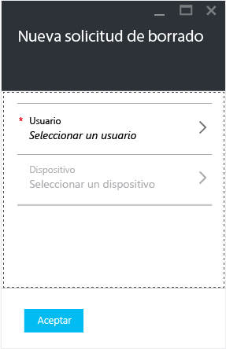
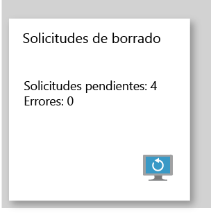

# Borrar los datos administrados de la aplicación de la empresa con Microsoft Intune

[!INCLUDE[classic-portal](../includes/classic-portal.md)]

Cuando un dispositivo se pierde o lo roban, o cuando un empleado deja la empresa, le interesa asegurarse de que se eliminan del dispositivo los datos de la aplicación de empresa. Pero es posible que no quiera quitar del dispositivo los datos personales, sobre todo si se trata de un dispositivo propiedad de un empleado.

Para quitar de forma selectiva datos de la aplicación de empresa, siga los pasos de este tema para crear una solicitud de borrado. Una vez finalizada la solicitud, la próxima vez que la aplicación se ejecute en el dispositivo, los datos de la empresa se quitarán de la aplicación.
>[!NOTE]
> Se quitan los contactos sincronizados directamente desde la aplicación en la libreta de direcciones nativa. No se pueden borrar los contactos sincronizados desde la libreta de direcciones nativa en otro origen externo. Actualmente esto se aplica únicamente a la aplicación Microsoft Outlook.

## Crear una solicitud de borrado

1.  Inicie sesión en Azure Portal y elija **Más servicios** > **Otros** > **Intune**.

2.  En la hoja de Intune, elija **Administrar aplicaciones**.

3.  Elija **Nueva solicitud de borrado**. Se abre la hoja **Nueva solicitud de borrado**.

    

4.  Elija **Usuario** para abrir la hoja **Usuario** y seleccione el usuario cuyos datos de aplicación quiera borrar.

5.  Elija **Dispositivo**.  Se abrirá la hoja **Dispositivo** que enumera todos los dispositivos asociados con el usuario seleccionado.  Seleccione el dispositivo que desea borrar.

6.  Ahora está de nuevo en la hoja **Nueva solicitud de borrado**. Seleccione **Aceptar** para realizar una solicitud de borrado. El servicio crea y realiza el seguimiento de una solicitud de borrado de datos independiente para cada aplicación protegida en el dispositivo.

## Supervisar las solicitudes de borrado de datos

En el mosaico **Solicitud de borrado** hay un informe resumido que muestra el estado general de la solicitud de borrado e incluye el número de solicitudes pendientes y errores. Para obtener más información, siga estos pasos:

1.  En la hoja de Intune, elija **Administrar aplicaciones**.

2.  En la hoja **Solicitud de borrado**, elija el icono **Solicitud de borrado** para abrir la hoja **Solicitud de borrado**.

3.  En la hoja **Solicitud de borrado**, puede ver la lista de solicitudes agrupadas según usuarios. Debido a que el sistema crea una solicitud de borrado para cada aplicación protegida que se ejecuta en el dispositivo, puede que vea varias solicitudes para un mismo usuario. Este estado indica si una solicitud de borrado está **pendiente**, ha provocado un **error** o si es **correcta**.

El usuario debe abrir la aplicación de la que se vaya a realizar el borrado, que puede tardar hasta 30 minutos después de efectuar la solicitud.

Los borrados con estado pendiente se muestran hasta que se eliminen manualmente.  Para eliminar manualmente una solicitud de borrado, haga clic derecho y seleccione Eliminar.

### Consulte también
[Proteger datos mediante las directivas de administración de aplicaciones móviles con Microsoft Intune](protect-app-data-using-mobile-app-management-policies-with-microsoft-intune.md)

[Usar Azure Portal](azure-portal-for-microsoft-intune-mam-policies.md)

<!--HONumber=Jan17_HO2-->

