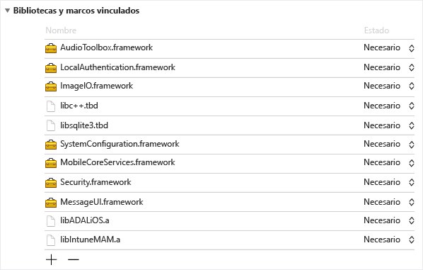
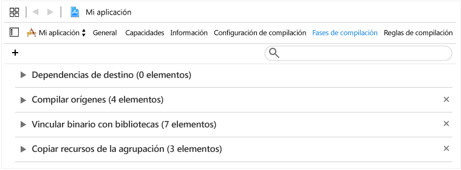
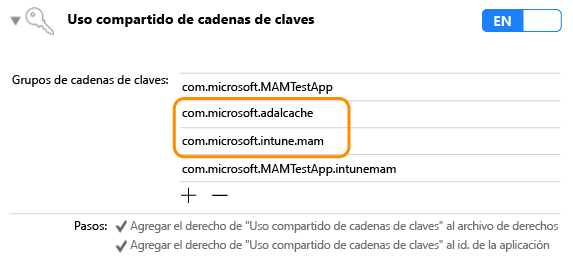

# <a name="microsoft-intune-app-sdk-for-ios-developer-guide"></a>Guía para desarrolladores acerca del SDK de aplicaciones de Microsoft Intune para iOS

> [!NOTE]
> Puede que quiera leer primero el artículo [Introducción a la Guía de Intune App SDK](intune-app-sdk-get-started.md), en el que se explica cómo preparar la integración en cada plataforma compatible.

El SDK de la aplicación Microsoft Intune para iOS permite incorporar directivas de protección de aplicaciones de Intune, en forma de administración de aplicaciones móviles (MAM), en su aplicación iOS. Una aplicación con MAM es aquella que está integrada con Intune App SDK. Permite a los administradores de TI implementar directivas en la aplicación móvil cuando Intune administra activamente la aplicación.

## <a name="prerequisites"></a>Requisitos previos

* Necesita un equipo Mac OS que ejecute OS X 10.8.5 o posterior y que tenga instalada la versión 5 o posterior del conjunto de herramientas XCode.

* Revise los [términos de licencia del SDK de aplicaciones de Intune para iOS](https://github.com/msintuneappsdk/ms-intune-app-sdk-ios/blob/master/Microsoft%20License%20Terms%20Intune%20App%20SDK%20for%20iOS%20.pdf). Imprimir y conservar una copia de los términos de licencia para sus archivos. Al descargar y usar el SDK de aplicaciones de Intune para iOS, acepta dichos términos.  Si no los acepta, no use el software.

## <a name="whats-in-the-sdk"></a>Qué hay en el SDK

El SDK para aplicaciones de Intune para iOS incluye una biblioteca estática, archivos de recursos, encabezados de API, un archivo .plist de configuración de depuración y una herramienta de configuración. Las aplicaciones móviles pueden incluir simplemente los archivos de recursos y vincularse estáticamente para la mayor parte de la aplicación de las directivas. Las características avanzadas de MAM de Intune se aplican a través de las API.

En esta guía se tratará el uso de los siguientes componentes del SDK de aplicaciones de Intune para iOS:

* **libIntuneMAM.a**: biblioteca estática del SDK de aplicaciones de Intune. Si su aplicación no usa extensiones, vincule esta biblioteca al proyecto para habilitar la aplicación para la administración de aplicaciones móviles de Intune.

* **IntuneMAM.framework**: marco del SDK de aplicaciones Intune. Vincule este marco al proyecto para habilitar la aplicación para la administración de aplicaciones móviles de Intune. Use el marco en lugar de la biblioteca estática si su aplicación usa extensiones, para que el proyecto no cree varias copias de la biblioteca estática.

* **IntuneMAMResources.Bundle**: lote de recursos que contiene los recursos en los que se basa el SDK.

* **Encabezados**: expone las API del SDK para aplicaciones de Intune. Si usa una API, deberá incluir el archivo de encabezado que contiene la API. Los archivos de encabezado siguientes incluyen las llamadas a funciones API necesarias para habilitar la funcionalidad del SDK de aplicaciones de Intune:

    * IntuneMAMAsyncResult.h
    * IntuneMAMDataProtectionInfo.h
    * IntuneMAMDataProtectionManager.h
    * IntuneMAMFileProtectionInfo.h
    * IntuneMAMFileProtectionManager.h
    * IntuneMAMPolicyDelegate.h
    * IntuneMAMLogger.h


## <a name="how-the-intune-app-sdk-works"></a>Cómo funciona el SDK para aplicaciones de Intune

El objetivo del SDK para aplicaciones de Intune para iOS es agregar capacidades de administración a las aplicaciones de iOS con mínimos cambios en el código. Cuantos menos cambios se hagan en el código, menor será el tiempo de comercialización; sin afectar a la coherencia y la estabilidad de la aplicación móvil seguirán estando garantizadas.

La aplicación debe vincularse a la biblioteca estática e incluir el lote de recursos. El archivo MAMDebugSettings.plist es opcional. Es opcional y puede incluirse en el paquete para simular las directivas MAM que se aplican a la aplicación sin necesidad de implementar la aplicación mediante Microsoft Intune. Además, en las compilaciones de depuración, puede aplicar las directivas del archivo MAMDebugSettings.plist transfiriendo el archivo al directorio de documentos de la aplicación mediante el uso compartido de archivos de iTunes.

## <a name="build-the-sdk-into-your-mobile-app"></a>Integrar el SDK en la aplicación móvil

Para habilitar Intune App SDK, siga estos pasos:

1. **Opción 1**: vincular a la biblioteca `libIntuneMAM.a`. Arrastre la bibloteca `libIntuneMAM.a` en la lista de **Linked Frameworks and Libraries** (Marcos y bibliotecas vinculados) del destino del proyecto.
    

    > [!NOTE]
    > Si tiene pensado publicar la aplicación en la Tienda de aplicaciones, use la versión de `libIntuneMAM.a` que se compila para publicación, y no la versión de depuración. La versión de lanzamiento estará en la carpeta **release**. La versión de depuración tiene un resultado detallado que ayuda a solucionar los problemas con el SDK de aplicaciones de Intune.

    **Opción 2**: vincule `IntuneMAM.framework` al proyecto. Arrastre `IntuneMAM.framework` en la lista de **Linked Frameworks and Libraries** (Marcos y bibliotecas vinculados) del destino del proyecto.

    > [!NOTE]
    > Si usa el marco, debe quitar manualmente las arquitecturas de simulador del marco universal antes de enviar la aplicación a la Tienda de aplicaciones. Consulte la sección "Enviar la aplicación a la Tienda de aplicaciones".

2. Agregue estos marcos de iOS al proyecto:
    * MessageUI.framework
    * Security.framework
    * MobileCoreServices.framework
    * SystemConfiguration.framework
    * libsqlite3.dylib
    * libc++.dylib
    * ImageIO.framework
    * LocalAuthentication.framework
    * AudioToolbox.framework

    > [!NOTE]
    > Si la aplicación está destinada a iOS 7, establezca el atributo `Status` de `LocalAuthentication.framework` en Opcional. Si no se establece `Status`, se producirá un error al iniciarse la aplicación en iOS 7.
    >
    > Además, Xcode 7 ha cambiado las extensiones `.dylib` a `.tbd`.

3. Agregue el lote de recursos `IntuneMAMResources.bundle` al proyecto arrastrando el lote de recursos de **Copy Bundle Resources** (Copiar recursos del lote) en **Build Phases** (Fases de compilación).


4. Agregue `-force_load {PATH_TO_LIB}/libIntuneMAM.a` a cualquiera de lo siguiente, reemplazando `{PATH_TO_LIB}` por la ubicación del SDK para aplicaciones de Intune:
    * Ajuste de la configuración de compilación `OTHER_LDFLAGS` del proyecto
    * **Otras marcas del enlazador** de la interfaz de usuario<br>

    > [!NOTE]
    > Para encontrar `PATH_TO_LIB`, seleccione el archivo `libIntuneMAM.a` y elija **Obtener información** en el menú **Archivo**. Copie y pegue la información **Dónde** (la ruta de acceso) de la sección **General** de la ventana **Información**.

5. Si la aplicación móvil define un guión gráfico o Nib principal en su Info.plist, quite los campos del **guion gráfico principal** o del **archivo Nib principal**. Agregue los valores de guión gráfico o Nib que quitó anteriormente en un diccionario nuevo denominado IntuneMAMSettings con los siguientes nombres de clave, según corresponda:
    * MainStoryboardFile
    * MainStoryboardFile~ipad
    * MainNibFile
    * MainNibFile~ipad

    > [!NOTE]
    > Si la aplicación móvil no define un archivo de guión gráfico o Nib principal en su archivo Info.plist, estos valores no son necesarios.

    Para ver Info.plist en formato sin procesar (para ver los nombres de claves), haga clic con el botón derecho en cualquier lugar del cuerpo del documento y cambie el tipo de vista a **Show Raw Keys/Values** (Mostrar claves/valores sin procesar).

6. Para habilitar el uso compartido de la cadena de claves (si aún no está habilitado), elija **Capacidades** en cada destino del proyecto y habilite el modificador del **uso compartido de cadena de claves**. El uso compartido de cadena de claves es necesario para que continúe con el siguiente paso.

    > [!NOTE]
    > El perfil de aprovisionamiento debe admitir nuevos valores de uso compartido de cadena de claves. Los grupos de acceso a cadena de claves deben admitir un carácter comodín. Para comprobar esto, abra el archivo .mobileprovision en un editor de texto, busque **keychain-access-groups** y asegúrese de que tiene un carácter comodín. Por ejemplo:     ```xml
    <key>keychain-access-groups</key>
    <array>
    <string>YOURBUNDLESEEDID.*</string>
    </array>
    ```

7. Después de habilitar el uso compartido de cadena de claves, siga estos pasos para crear un grupo de acceso independiente en el que se almacenarán los datos del SDK para aplicaciones de Intune. Puede crear un grupo de acceso a cadena de claves mediante la interfaz de usuario o mediante el archivo de derechos.

    Mediante la interfaz de usuario para crear un grupo de acceso a cadena de claves:

    a. Si la aplicación móvil no tiene ningún grupo de acceso a cadena de claves definido, agregue el id. del lote de la aplicación como el primer grupo.

    b. Agregue el grupo de cadenas de claves compartidas `com.microsoft.intune.mam`. Intune App SDK usa este grupo de acceso para almacenar datos.

    c. Agregue `com.microsoft.adalcache` a los grupos de acceso existentes.

    

    Si usa el archivo de derechos para crear el grupo de acceso a la cadena de claves, deberá anteponer `$(AppIdentifierPrefix)` al grupo de accesos de cadena de claves en el archivo de derechos. Por ejemplo:  

    * `$(AppIdentifierPrefix)com.microsoft.intune.mam`
    * `$(AppIdentifierPrefix)com.microsoft.adalcache`

    > [!NOTE]
    > Un archivo de derechos es un archivo XML que es exclusivo para su aplicación móvil. Se utiliza para especificar permisos especiales y capacidades en su aplicación iOS.

8. Si la aplicación define los esquemas de direcciones URL en su archivo Info.plist, agregue otro esquema, con un sufijo `-intunemam` para cada esquema de dirección URL.

9. Para las aplicaciones móviles desarrolladas para iOS 9+, incluya cada protocolo que su aplicación pasa a `UIApplication canOpenURL` en la matriz `LSApplicationQueriesSchemes` del archivo Info.plist de la aplicación. Además, para cada protocolo que se muestra, agregue un nuevo protocolo y anéxelo con `-intunemam`. También debe incluir `http-intunemam`, `https-intunemam`y `ms-outlook-intunemam` en la matriz.

10. Si la aplicación tiene grupos de aplicaciones definidos en sus derechos, agregue estos grupos al diccionario IntuneMAMSettings en la clave `AppGroupIdentitifiers` como una matriz de cadenas.

11. Vincule la aplicación móvil a la biblioteca de autenticación de Azure Directory (ADAL). La biblioteca ADAL para Objective C está [disponible en GitHub](https://github.com/AzureAD/azure-activedirectory-library-for-objc).

    > [!NOTE]
    > El SDK para aplicaciones de Intune se ha probado con el código de la bifurcación del agente de AAL desde el 19 de junio de 2015. Asegúrese de que está vinculando con la versión más reciente o de trabajo de la biblioteca ADAL.

12. Incluya el lote de recursos `ADALiOSBundle.bundle` del proyecto arrastrando el lote de recursos de **Copy Bundle Resources** (Copiar recursos del lote) en **Build Phases** (Fases de compilación).

13. Use la opción del enlazador `-force_load PATH_TO_ADAL_LIBRARY` al vincular a la biblioteca.

    Agregue `-force_load {PATH_TO_LIB}/libADALiOS.a` al ajuste de la configuración de compilación `OTHER_LDFLAGS` del proyecto u **Other Linker Flags** (Otras marcas del enlazador) en la interfaz de usuario. `PATH_TO_LIB` debe reemplazarse por la ubicación de archivos binarios de ADAL.

## <a name="set-up-azure-directory-authentication-library"></a>Configurar Biblioteca de autenticación de Active Directory

El SDK para aplicaciones de Intune usa ADAL para sus escenarios de inicio condicional y de autenticación. También se basa en ADAL para registrar la identidad del usuario con el servicio de MAM para la administración sin escenarios de inscripción de dispositivos.

Normalmente, ADAL requiere que las aplicaciones se registren con Azure Active Directory (Azure AD) y que obtengan un identificador único, conocido como ClientID, y otros identificadores para garantizar la seguridad de los tokens concedidos a la aplicación. Intune App SDK usa valores de registro predeterminados al ponerse en contacto con Azure AD.  

Si la propia aplicación usa ADAL para su escenario de autenticación, la aplicación debe utilizar los valores de registro existentes y reemplazar los valores predeterminados de Intune App SDK. Esto garantiza que no se pide a los usuarios que se vuelva a autenticar (una Intune App SDK y otra la aplicación).

### <a name="adal-faqs"></a>Preguntas más frecuentes sobre ADAL

**¿Qué archivos binarios de ADAL debo usar?**

Intune App SDK usa actualmente la bifurcación del agente de [ADAL en GitHub](https://github.com/AzureAD/azure-activedirectory-library-for-objc) para admitir aplicaciones que requieren acceso condicional. (Estas aplicaciones, por lo tanto, dependen de la aplicación Microsoft Authenticator). Sin embargo, el SDK sigue siendo compatible con la bifurcación principal de ADAL. Use la bifurcación que sea adecuada para su aplicación.

**¿Cómo se vincula a archivos binarios de ADAL?**

Agregue `-force_load {PATH_TO_LIB}/libADALiOS.a` al ajuste de la configuración de compilación `OTHER_LDFLAGS` del proyecto u **Other Linker Flags** (Otras marcas del enlazador) en la interfaz de usuario. `PATH_TO_LIB` debe reemplazarse por la ubicación de archivos binarios de ADAL. Asegúrese también de copiar el lote de ADAL en su aplicación.  

Para obtener más información, consulte las instrucciones de [ADAL en GitHub](https://github.com/AzureAD/azure-activedirectory-library-for-objc).

**¿Cómo se puede compartir la caché de ADAL con otras aplicaciones firmadas con el mismo perfil de aprovisionamiento?**

Si la aplicación no tiene definido ningún grupo de acceso a cadena de claves, agregue el identificador del lote de la aplicación como el primer grupo.

Habilite el inicio de sesión único (SSO) de ADAL agregando los grupos de acceso `com.microsoft.adalcache` y `com.microsoft.workplacejoin` en los derechos de acceso a claves.

En caso de que esté estableciendo explícitamente el grupo de cadenas de claves de caché compartida de ADAL, asegúrese de que esté establecido en `<app_id_prefix>.com.microsoft.adalcache`. ADAL lo establecerá automáticamente a menos que lo reemplace. Si quiere especificar un grupo de cadenas de claves personalizado para reemplazar `com.microsoft.adalcache`, especifíquelo en el archivo Info.plist, en "IntuneMAMSettings", mediante la clave `ADALCacheKeychainGroupOverride`.

**¿Cómo se fuerza a que el SDK de aplicaciones de Intune use los valores de ADAL que ya usa mi aplicación?**

Si su aplicación ya usa ADAL, consulte la sección sobre IntuneMAMSettings para obtener información sobre cómo rellenar las opciones siguientes:  

* ADALClientId
* ADALRedirectUri
* ADALRedirectScheme
* ADALCacheKeychainGroupOverride

**¿Cómo se alterna entre los entornos de producción y de prueba interna de Azure AD?**

Puede usar la opción `AadAuthorityURI` en MAMPolicies.plist para especificar el entorno de Azure AD utilizado para llamadas de AAL. Actualmente está establecido para que use el entorno de preproducción (PPE) de Azure AD de forma predeterminada a menos que se reemplace.

Para realizar pruebas en el PPE, puede usar un modificador en tiempo de compilación o en tiempo de ejecución.

En el caso de un conmutador de entorno en tiempo de compilación de direcciones URL de servicio MAM y Azure AD, establezca la marca booleana `UsePPE` en True en MAMEnvironment.plist. (Nota: No es posible hacerlo a través de Info.plist).

En el caso de un conmutador de entorno en tiempo de ejecución, establezca `com.microsoft.intune.mam.useppe` en "1" en los valores predeterminados del usuario estándar para que se use el PPE. Esto reemplaza el valor `com.microsoft.intune.mam.AADAuthorityEnvironment` existente.

**¿Cómo se puede reemplazar la dirección URL de la entidad de Azure AD por una dirección URL específica del inquilino proporcionada en tiempo de ejecución?**

Establezca la propiedad `aadAuthorityUriOverride` en la instancia IntuneMAMPolicyManager.

> [!NOTE]
> Esto es necesario en el escenario de MAM sin que la inscripción del dispositivo permita al SDK reutilizar el token de actualización de ADAL capturado por la aplicación.

El SDK seguirá usando esta dirección URL de la entidad para la actualización de directivas y para las solicitudes de inscripción posteriores a menos que el valor se elimine o se cambie.  Es importante borrar el valor cuando un usuario corporativo cierra la sesión de la aplicación y restablecerlo cuando inicia sesión otro usuario corporativo.

**¿Qué debo hacer si mi aplicación ya usa ADAL para la autenticación?**

Las siguientes acciones son necesarias si la aplicación ya usa ADAL para la autenticación:

* En el archivo Info.plist del proyecto, en el diccionario IntuneMAMSettings con el nombre de clave `ADALClientId`, especifique el ClientID que se usará para llamadas de ADAL.

* En el archivo Info.plist del proyecto, en el diccionario IntuneMAMSettings con el nombre de clave `ADALRedirectUri`, especifique el URI de redirección que se usará para llamadas de ADAL. También debe especificar `ADALRedirectScheme` según el formato del URI de redirección de la aplicación.

**¿Qué ocurre si mi aplicación no utiliza todavía ADAL para la autenticación?**

Si su aplicación no usa ADAL, Intune App SDK proporcionará valores predeterminados para parámetros ADAL y controlará la autenticación en Azure AD.

## <a name="register-your-app-with-the-intune-mam-service"></a>Registrar la aplicación con el servicio de MAM de Intune

### <a name="use-the-apis"></a>Usar las API
El SDK de aplicaciones de Intune ahora permite que las aplicaciones de iOS reciban directivas de MAM desde Intune sin necesidad de estar inscrito en Intune mediante la administración de dispositivos móviles (MDM). Para admitir esta nueva funcionalidad, el SDK proporciona nuevas API que permiten que la aplicación reciba directivas de MAM. Para usar las nuevas API, siga estos pasos:

1. Use la versión más reciente del SDK de aplicaciones de Intune que admite la administración de aplicaciones con o sin la inscripción de dispositivos. Si la aplicación ha usado una versión anterior del SDK sin esta característica, tendrá que actualizar la biblioteca de MAM de Intune, así como la carpeta Headers con los encabezados del SDK más reciente.

2. Agregar IntuneMAMEnrollment.h a todos los archivos que llamen a las API.

3. Para realizar pruebas en el PPE, puede usar un modificador en tiempo de compilación o en tiempo de ejecución.

    En el caso de un conmutador de entorno en tiempo de compilación de direcciones URL de servicio MAM y Azure AD, establezca la marca booleana `UsePPE` en True en MAMEnvironment.plist. (Nota: No es posible hacerlo a través de Info.plist).

    En el caso de un conmutador de entorno en tiempo de ejecución, establezca `com.microsoft.intune.mam.useppe` en "1" en los valores predeterminados del usuario estándar para que se use el PPE. Esto reemplaza el valor `com.microsoft.intune.mam.AADAuthorityEnvironment` existente.


### <a name="register-accounts"></a>Registrar cuentas

Una aplicación puede recibir directivas de MAM desde el servicio de Intune si está inscrita en nombre de una cuenta de usuario especificada. La aplicación se encarga de registrar los usuarios que hayan iniciado sesión recientemente con Intune App SDK. Después de que se haya autenticado la nueva cuenta de usuario, la aplicación debe llamar al método `registerAndEnrollAccount` de Headers/IntuneMAMEnrollment.h:

```objc
/**


 *  This method will add the account to the list of registered accounts.
 *  An enrollment request will immediately be started.
 *  @param identity The UPN of the account to be registered with the SDK
 */

(void)registerAndEnrollAccount:(NSString *)identity;

```
Al llamar al método `registerAndEnrollAccount`, el SDK registrará la cuenta de usuario e intentará inscribir la aplicación en nombre de esta cuenta. Si, por cualquier motivo, se produce un error en la inscripción, el SDK intentará volver a realizar la inscripción automáticamente 24 horas más tarde. Con fines de depuración, la aplicación puede recibir notificaciones a través de un delegado sobre los resultados de las solicitudes de inscripción.

Una vez que se haya invocado esta API, la aplicación puede seguir funcionando de la manera habitual. Si la inscripción se realiza correctamente, el SDK le notificará al usuario que se debe reiniciar la aplicación. En ese momento, el usuario puede reiniciar inmediatamente la aplicación.

### <a name="deregister-accounts"></a>Anular el registro de cuentas

Antes de que un usuario cierre sesión en una aplicación, la aplicación debe eliminar el registro del usuario del SDK. De este modo, se garantizará lo siguiente:

1. Ya no se realizarán reintentos de inscripción para la cuenta del usuario.

2. Si el usuario ha inscrito correctamente la aplicación, se anulará la inscripción del usuario y de la aplicación en el servicio de MAM de Intune y se quitarán las directivas de MAM.

3. Si la aplicación inicia un borrado selectivo (opcional), se eliminan todos los datos profesionales o educativos relacionados.

Antes de que el usuario cierre sesión, la aplicación debe llamar a la siguiente API en Headers/IntuneMAMEnrollment.h:

```objc
/*
 *  This method will remove the provided account from the list of
 *  registered accounts.  Once removed, if the account has enrolled
 *  the application, the account will be un-enrolled.
 *  @note In the case where an un-enroll is required, this method will block
 *  until the Intune MAM AAD token is acquired, then return.  This method must be called before  
 *  the user is removed from the application (so that required AAD tokens are not purged
 *  before this method is called).
 *  @param identity The UPN of the account to be removed.
 *  @param doWipe   If YES, a selective wipe if the account is un-enrolled
 */

(void)deRegisterAndUnenrollAccount:(NSString *)identity withWipe:(BOOL)doWipe;
```

Es necesario llamar a este método antes de eliminar los tokens de Azure AD de la cuenta de usuario. El SDK necesita el token de la aplicación del usuario para realizar solicitudes específicas en el servicio de MAM de Intune en nombre del usuario.

Si la aplicación va a eliminar por sí misma los datos profesionales o educativos relacionados, la marca `doWipe` se puede establecer en False. De lo contrario, la aplicación puede hacer que el SDK inicie un borrado selectivo. Esto provocará una llamada al delegado de borrado selectivo de la aplicación.

```objc
[[IntuneMAMEnrollmentManager instance] deRegisterAndUnenrollAccount:@”user@foo.com” withWipe:YES];
```

## <a name="enroll-without-prior-sign-in"></a>Realizar la inscripción sin un inicio de sesión previo

Aunque una aplicación no inicie la sesión del usuario con Azure Active Directory, puede recibir directivas de MAM del servicio de Intune mediante una llamada a la API para que el SDK controle la autenticación. Las aplicaciones deben usar esta técnica cuando no hayan autenticado un usuario con Azure AD, pero sigan necesitando recuperar directivas MAM para ayudar a proteger los datos. Un ejemplo es si otro servicio de autenticación se utiliza para iniciar sesión en la aplicación, o si la aplicación no admite el inicio de sesión en absoluto. Para ello, la aplicación debe llamar al método `loginAndEnrollAccount` en Headers/IntuneMAMEnrollment.h:

```objc
/**
 *  Creates an enrollment request which is started immediately.
 *  If no token can be retrieved for the identity, the user will be prompted
 *  to enter their credentials, after which enrollment will be retried.
 *  @param identity The UPN of the account to be logged in and enrolled.
 */
 (void)loginAndEnrollAccount: (NSString *)identity;

```

Al llamar a este método, el SDK pedirá al usuario las credenciales si no se encuentra ningún token existente. El SDK intentará inscribir la aplicación en el nombre de esta cuenta. Se puede llamar al método con "nulo" como identidad. En este caso, el SDK se inscribirá con el usuario de MAM existente en el dispositivo, o bien le pedirá al usuario un nombre de usuario si no encuentra ninguno.

Si se produce un error en la inscripción, la aplicación debe considerar la posibilidad de llamar a esta API de nuevo en el futuro, en función de los detalles del error. La aplicación puede recibir notificaciones a través de un delegado sobre los resultados de las solicitudes de inscripción.

Una vez que se haya invocado esta API, la aplicación puede seguir funcionando de la manera habitual. Si la inscripción se realiza correctamente, el SDK le notificará al usuario que se debe reiniciar la aplicación.

## <a name="debug-information"></a>Información de depuración

La aplicación puede recibir notificaciones de depuración sobre las solicitudes siguientes en el servicio de MAM de Intune:

 - Solicitudes de inscripción
 - Solicitudes de actualización de directivas
 - Solicitudes de cancelación de inscripción

Las notificaciones se presentan a través de métodos delegados en Headers/IntuneMAMEnrollmentDelegate.h:

```objc
/**
 *  Called when an enrollment request operation is completed.
 * @param status status object containing debug information
 */

(void)enrollmentRequestWithStatus:(IntuneMAMEnrollmentStatus *)status;

/**
 *  Called when a MAM policy request operation is completed.
 *  @param status status object containing debug information
 */
(void)policyRequestWithStatus:(IntuneMAMEnrollmentStatus *)status;

/**
 *  Called when a un-enroll request operation is completed.
 *  @Note: when a user is un-enrolled, the user is also de-registered with the SDK
 *  @param status status object containing debug information
 */

(void)unenrollRequestWithStatus:(IntuneMAMEnrollmentStatus *)status;

```

Estos métodos delegados devuelven un objeto `IntuneMAMEnrollmentStatus` que contiene la información siguiente:

- La identidad de la cuenta asociada a la solicitud
- El código de estado que indica el resultado de la solicitud
- Una cadena de error con una descripción del código de estado
- Objeto `NSError`

Este objeto está definido en Headers/IntuneMAMEnrollmentStatus.h junto con los códigos de estado específicos que se pueden devolver.

Es importante tener en cuenta que la lógica de negocios de la aplicación no debe basarse en estas notificaciones. La idea es que la aplicación envíe esta información a un servicio de telemetría con fines de depuración o supervisión.


## <a name="sample-code"></a>Código de ejemplo

A continuación se muestran implementaciones de ejemplo de los métodos delegados:

```objc
- (void)enrollmentRequestWithStatus:(IntuneMAMEnrollmentStatus *)status


{


    NSLog(@"enrollment result for identity %@ with status code %ld", status.identity, (unsigned long)status.statusCode);


    NSLog(@"Debug Message: %@", status.errorString);


}


- (void)policyRequestWithStatus:(IntuneMAMEnrollmentStatus *)status


{


    NSLog(@"policy check-in result for identity %@ with status code %ld", status.identity, (unsigned long)status.statusCode);


    NSLog(@"Debug Message: %@", status.errorString);


}


- (void)unenrollRequestWithStatus:(IntuneMAMEnrollmentStatus *)status


{


    NSLog(@"un-enroll result for identity %@ with status code %ld", status.identity, (unsigned long)status.statusCode);


    NSLog(@"Debug Message: %@", status.errorString);


}

```

## <a name="app-restart"></a>Reinicio de la aplicación

Cuando una aplicación recibe directivas de MAM por primera vez, deberá reiniciarse para aplicar los enlaces necesarios. Con el fin de notificarle a la aplicación que debe producirse un reinicio, el SDK proporciona un método delegado en Headers/IntuneMAMPolicyDelegate.h.

```objc
 - (BOOL) restartApplication
```
El valor devuelto por este método le indicará al SDK si la aplicación controlará el reinicio necesario:   

 - Si se devuelve True, la aplicación controlará el reinicio.   
 - Si se devuelve False, el SDK reiniciará la aplicación después de la devolución de este método. Inmediatamente, el SDK mostrará un cuadro de diálogo que le indicará al usuario que reinicie la aplicación.

## <a name="implement-save-as-controls"></a>Implementar controles Guardar como

Intune permite a los administradores de TI seleccionen las ubicaciones de almacenamiento en las que puede guardar datos una aplicación administrada. Las aplicaciones pueden consultar en el SDK para aplicaciones de Intune las ubicaciones de almacenamiento permitidas mediante la API **isSaveToAllowedForLocation**.

Antes de que las aplicaciones puedan guardar datos administrados en ubicaciones locales o de almacenamiento en la nube, deben realizar una comprobación con la API **isSaveToAllowedForLocation** para saber si el administrador de TI permite que se guarden datos ahí.

Cuando las aplicaciones usen la API **isSaveToAllowedForLocation**, deben pasar el UPN para la ubicación de almacenamiento, si está disponible.

### <a name="supported-save-locations"></a>Ubicaciones de almacenamiento admitidas

La API **isSaveToAllowedForLocation** proporciona constantes para comprobar si el administrador de TI permite que los datos se guarden en las ubicaciones siguientes:

* IntuneMAMSaveLocationOther
* IntuneMAMSaveLocationOneDriveForBusiness
* IntuneMAMSaveLocationSharePoint
* IntuneMAMSaveLocationBox
* IntuneMAMSaveLocationDropbox
* IntuneMAMSaveLocationGoogleDrive
* IntuneMAMSaveLocationLocalDrive

Las aplicaciones deben usar las constantes de la API **isSaveToAllowedForLocation** para comprobar si los datos se pueden guardar en ubicaciones que se consideran "administradas", como OneDrive para la Empresa, o "personales". Además, la API debe usarse cuando la aplicación no puede determinar si una ubicación es "administrada" o "personal".

Cuando se sabe que una ubicación es “personal”, las aplicaciones deben usar el valor **IntuneMAMSaveLocationOther**.

La constante **IntuneMAMSaveLocationLocalDrive** debe usarse cuando la aplicación guarda datos en cualquier ubicación del dispositivo local.

## <a name="set-up-the-intune-app-sdk"></a>Configurar Intune App SDK

Use el diccionario IntuneMAMSettings del archivo Info.plist de la aplicación para configurar Intune App SDK. La siguiente tabla enumera todas las configuraciones compatibles.

Es posible que se hayan tratado algunos de estos valores en las secciones anteriores y que otros no se apliquen a todas las aplicaciones.

Configuración  | Tipo  | Definición | ¿Necesario?
--       |  --   |   --       |  --
ADALClientId  | String  | Identificador de cliente de Azure AD de la aplicación. | Se requiere si la aplicación usa ADAL.
ADALRedirectUri  | String  | URI de redireccionamiento de Azure AD de la aplicación. | Se requiere ADALRedirectUri o ADALRedirectScheme si la aplicación usa ADAL.
ADALRedirectScheme  | String  | Esquema de redireccionamiento de Azure AD de la aplicación. Puede usarse en lugar de ADALRedirectUri si el URI de redireccionamiento de la aplicación se encuentra en el formato `scheme://bundle_id`. | Se requiere ADALRedirectUri o ADALRedirectScheme si la aplicación usa ADAL.
ADALLogOverrideDisabled | Boolean  | Especifica si el SDK enrutará todos los registros de ADAL (incluidas las llamadas de ADAL desde la aplicación de haberlas) a su propio archivo de registro. El valor predeterminado es NO. Establezca la opción en SÍ si la aplicación establecerá su propia devolución de llamada de registros ADAL. | Opcional.
ADALCacheKeychainGroupOverride | String  | Especifica el grupo de cadena de claves que se usará para la caché de ADAL en lugar de "com.microsoft.adalcache". Tenga en cuenta que no contiene el prefijo de identificador de la aplicación. Se incluirá el prefijo en la cadena proporcionada en tiempo de ejecución. | Opcional.
AppGroupIdentifiers | Matriz de cadena  | Matriz de grupos de aplicación de la sección de grupos de com.apple.security.application-groups de derechos de la aplicación. | Se requiere si la aplicación usa grupos de aplicaciones.
ContainingAppBundleId | String | Especifica el id. del lote de la aplicación contenedora de la extensión. | Se requiere para las extensiones de iOS.
DebugSettingsEnabled| Boolean | Si se establece en Sí, se pueden aplicar directivas de prueba en el lote de configuración. Las aplicaciones *no* se deben proporcionar con esta opción habilitada. | Opcional.
MainNibFile<br>MainNibFile~ipad  | String  | Esta configuración debe contener el nombre de archivo nib principal de la aplicación.  | Obligatorio si la aplicación define MainNibFile en Info.plist.
MainStoryboardFile<br>MainStoryboardFile~ipad  | String  | Esta configuración debe contener el nombre de archivo de guion gráfico principal de la aplicación. | Se requiere si la aplicación define UIMainStoryboardFile en Info.plist.
MAMPolicyRequired| Boolean| Especifica si se bloqueará el inicio de la aplicación en caso de que no tenga una directiva de MAM de Intune. El valor predeterminado es NO. | Opcional.
MAMPolicyWarnAbsent | Boolean| Especifica si la aplicación avisará al usuario durante el inicio en caso de que no tenga una directiva de MAM de Intune. Nota: Las aplicaciones no se puede enviar a la tienda con esta opción establecida en SÍ. | Opcional.
MultiIdentity | Boolean| Especifica si la aplicación es compatible con varias identidades. | Opcional.
SplashIconFile <br>SplashIconFile~ipad | String  | Especifica el archivo del icono de la pantalla de presentación (inicio) de Intune. | Opcional.
SplashDuration | Número | Cantidad mínima de tiempo en segundos en que se mostrará la pantalla de presentación de Intune al iniciar la aplicación. El valor predeterminado es 1,5. | Opcional.
BackgroundColor| String| Especifica el color de fondo para los paneles de PIN e inicio. Acepta una cadena RGB hexadecimal con el formato #XXXXXX, donde las X pueden ir de 0 a 9 o de A a F. Se puede omitir la almohadilla.   | Opcional. El valor predeterminado es gris claro.
ForegroundColor| String| Especifica el color de primer plano para los paneles de PIN e inicio, como el color del texto. Acepta una cadena RGB hexadecimal con el formato #XXXXXX, donde las X pueden ir de 0 a 9 o de A a F. Se puede omitir la almohadilla.  | Opcional. El valor predeterminado es negro.
AccentColor | String| Especifica el color de énfasis de la pantalla de PIN, como el color del texto de botón y el color de resaltado del cuadro. Acepta una cadena RGB hexadecimal con el formato #XXXXXX, donde las X pueden ir de 0 a 9 o de A a F. Se puede omitir la almohadilla.| Opcional. El valor predeterminado es el azul del sistema.
MAMTelemetryDisabled| Boolean| Especifica si el SDK no enviará los datos de telemetría a su back-end.| Opcional.
MAMTelemetryUsePPE | Boolean | Especifica si el SDK enviará datos al back-end de PPE. Úselo cuando pruebe las aplicaciones con la directiva de Intune para que los datos de telemetría de prueba no se mezclen con los datos del cliente. | Opcional.

## <a name="telemetry"></a>Telemetría

De manera predeterminada, el SDK de aplicaciones de Intune para iOS registra los datos de telemetría en los siguientes eventos de uso. Estos datos se envían a Microsoft Intune.

* **Inicio de la aplicación**: para ayudar a Microsoft Intune a obtener información sobre el uso de la aplicación habilitada para MAM por tipo de administración (inscripción de MAM con MDM, de MAM sin MDM, etc.).
* **Llamada API de EnrollApplication**: para ayudar a Microsoft Intune a obtener información sobre la tasa de éxito y otras métricas de rendimiento de las llamadas de `enrollApplication` desde el cliente.

> [!NOTE]
> Si decide no enviar datos de telemetría del SDK para aplicaciones de Intune a Microsoft desde su aplicación móvil, debe deshabilitar la transmisión de telemetría de Intune App SDK. Establezca la propiedad `MAMTelemetryDisabled` en SÍ en el diccionario IntuneMAMSettings.

## <a name="enable-multi-identity-optional"></a>Habilitar varias identidades (opcional)

De forma predeterminada, el SDK aplicará una directiva a la aplicación en su conjunto. La característica de varias identidades es una característica MAM que puede habilitar para aplicar una directiva en un nivel por identidad. Esto requiere más participación en la aplicación que otras características de MAM.

La aplicación debe informar al SDK de la aplicación cuando intente cambiar la identidad activa. El SDK también notificará a la aplicación cuando se requiera un cambio de identidad. Actualmente, solo se admite una identidad administrada. Una vez que el usuario inscriba el dispositivo o la aplicación, el SDK usa esta identidad y la considera la identidad administrada principal. Los demás usuarios de la aplicación se tratarán como usuarios no administrados con una configuración de directiva sin restricciones.

Tenga en cuenta que una identidad se define simplemente como una cadena. Las identidades no distinguen mayúsculas de minúsculas. Las solicitudes al SDK podrían no devolverse con el mismo uso de mayúsculas y minúsculas que se empleó originalmente al establecer la identidad.

### <a name="identity-overview"></a>Introducción a la identidad

Una identidad es simplemente el nombre de usuario de una cuenta (por ejemplo, user@contoso.com). Los desarrolladores pueden establecer la identidad de la aplicación en los niveles siguientes:

* **Identidad de proceso**: establece la identidad de todo el proceso y se usa principalmente para aplicaciones de una sola identidad. Esta identidad afecta a todas las tareas, los archivos y la interfaz de usuario.
* **Identidad de la interfaz de usuario**: determina qué directivas se aplican a las tareas de la interfaz de usuario en el subproceso principal, como cortar/copiar/pegar, PIN, autenticación y uso compartido de datos. La identidad de la interfaz de usuario no afecta a las tareas de archivos como el cifrado y la copia de seguridad.
* **Identidad de subproceso**: afecta a qué directivas se aplican en el subproceso actual. Esta identidad afecta a todas las tareas, los archivos y la interfaz de usuario.

La aplicación es responsable de establecer las identidades correctamente, tanto si el usuario está administrado como si no.

En todo momento, los subprocesos tienen una identidad eficaz para las tareas de la interfaz de usuario y las tareas de archivos. Esta es la identidad que se usa para comprobar qué directivas se deben aplicar, en caso de que las haya. Si la identidad es "Ninguna identidad" o si el usuario no está administrado, no se aplica ninguna directiva.

### <a name="thread-queues"></a>Colas de subprocesos

Las aplicaciones suelen enviar las tareas sincrónicas y asincrónicas a colas de subprocesos. El SDK intercepta las llamadas de Grand Central Dispatch (GCD) y asocia la identidad del subproceso actual con las tareas enviadas. Cuando finalizan las tareas, el SDK cambia temporalmente la identidad del subproceso a la identidad asociada con la tarea, finaliza las tareas y restaura la identidad del subproceso original.


Dado que `NSOperationQueue` se basa en GCD, `NSOperations` se ejecutará en la identidad del subproceso en el momento en que las tareas se agreguen a `NSOperationQueue`. `NSOperations` o las funciones que se envían usando GCD directamente también pueden cambiar la identidad del subproceso actual cuando se ejecutan. Esta identidad reemplazará la identidad heredada del subproceso de envío.

### <a name="file-owner"></a>Propietario del archivo

El SDK hace un seguimiento de las identidades de los propietarios del archivo local y aplica las directivas según corresponda. El propietario del archivo se establece cuando el archivo se crea o se abre en modo de truncamiento. El propietario se establece en la identidad de la tarea de archivo efectiva del subproceso que realiza la tarea.

Las aplicaciones también pueden establecer la identidad del propietario del archivo explícitamente mediante `IntuneMAMFilePolicyManager`. Las aplicaciones pueden usar `IntuneMAMFilePolicyManager` para recuperar el propietario del archivo y establecer la identidad de la interfaz de usuario antes de mostrar el contenido del archivo.

### <a name="shared-data"></a>Datos compartidos

Si la aplicación crea archivos que contienen datos de los usuarios administrados y no administrados, la aplicación es responsable de cifrar los datos del usuario administrado. Puede cifrar los datos mediante el uso de las API `protect` y `unprotect` en `IntuneMAMDataProtectionManager`.

El método `protect` acepta una identidad que puede ser un usuario administrado o no administrado. Si el usuario está administrado, se cifrarán los datos. Si el usuario no está administrado, se agregará un encabezado a los datos para cifrar la identidad, pero los datos no se cifrarán. Puede usar el método `protectionInfo` para recuperar el propietario de los datos.

### <a name="share-extensions"></a>Extensiones de recurso compartido

Si la aplicación contiene una extensión de recurso compartido, el propietario del elemento que se comparte se puede recuperar mediante el método `protectionInfoForItemProvider` en `IntuneMAMDataProtectionManager`. Si el elemento compartido es un archivo, el SDK controlará la configuración del propietario del archivo. Si el elemento compartido son datos, la aplicación es responsable de establecer el propietario del archivo si estos datos se almacenan en un archivo, y de la llamada a la API de `setUIPolicyIdentity` antes de mostrar estos datos en la interfaz de usuario.

### <a name="turning-on-multi-identity"></a>Activar varias identidades

De forma predeterminada, se considera que las aplicaciones son de una única identidad. El SDK establece la identidad del proceso en el usuario inscrito. Para habilitar la compatibilidad con varias identidades, agregue un valor booleano denominado `MultiIdentity` y un valor SÍ al diccionario IntuneMAMSettings en el archivo Info.plist de la aplicación.

> [!NOTE]
> Cuando se habilita la característica de varias identidades, la identidad del proceso, la identidad de la interfaz de usuario y las identidades de subproceso se establecerán en "nulo". La aplicación es responsable de la configuración de forma adecuada.

### <a name="switching-identities"></a>Cambiar las identidades

* **Cambio de identidad iniciado por la aplicación**:

    Cuando se inicia una aplicación con varias identidades, se considera que se ejecuta en una cuenta desconocida no administrada. La interfaz de usuario de inicio condicional no se ejecutará y no se aplicarán directivas en la aplicación. La aplicación es responsable de notificarle al SDK si debe cambiarse la identidad. Normalmente, esto ocurre cada vez que la aplicación va a mostrar los datos de una cuenta de usuario específica.

    Un ejemplo es cuando el usuario intenta abrir un documento, un buzón o una pestaña en un portátil. La aplicación debe notificar al SDK antes de que se abran el archivo, el buzón o la pestaña. Esto se hace mediante la API `setUIPolicyIdentity` en `IntuneMAMPolicyManager`. Es necesario llamar a esta API tanto si el usuario está administrado como si no. Si el usuario está administrado, el SDK llevará a cabo las comprobaciones de inicio condicional (como la detección de jailbreak, PIN y autenticación).

    El resultado del cambio de identidad se devuelve a la aplicación de forma asincrónica a través de un controlador de finalización. La aplicación debe posponer la apertura del documento, el buzón de correo o la ficha hasta que se devuelva un código de resultado correcto. Si se produce un error en el cambio de identidad, la aplicación debe cancelar la tarea.

* **Cambio de identidad iniciado por el SDK**:

    A veces, el SDK debe pedirle a la aplicación que cambie a una identidad específica. Las aplicaciones con varias identidades deben implementar el método `identitySwitchRequired` en `IntuneMAMPolicyDelegate` para atender esta solicitud.

    Cuando se llama a este método, si la aplicación puede atender la solicitud para cambiar a la identidad especificada, debe pasar `IntuneMAMAddIdentityResultSuccess` al controlador de finalización. Si no puede atender el cambio de identidad, la aplicación debe pasar `IntuneMAMAddIdentityResultFailed` al controlador de finalización.

    La aplicación no tiene que llamar a `setUIPolicyIdentity` en respuesta a esta llamada. Si el SDK necesita que la aplicación cambie a una cuenta de usuario no administrado, se pasará la cadena vacía en la llamada a `identitySwitchRequired`.

* **Borrado selectivo**:

    Cuando la aplicación se borra de forma selectiva, el SDK llamará al método `wipeDataForAccount` en `IntuneMAMPolicyDelegate`. La aplicación es responsable de quitar la cuenta del usuario especificado y todos los datos asociados. El SDK puede quitar todos los archivos que pertenecen al usuario, y lo hará si la aplicación devuelve FALSE tras la llamada a `wipeDataForAccount`.

    Tenga en cuenta que este método se llama desde un subproceso en segundo plano. La aplicación no debe devolver un valor hasta que se hayan quitado todos los datos del usuario (a excepción de los archivos si la aplicación devuelve el valor FALSE).

## <a name="debug-the-intune-app-sdk-in-xcode"></a>Depurar el SDK de aplicaciones de Intune en Xcode

Antes de probar manualmente la aplicación habilitada para MAM con Microsoft Intune, puede usar un archivo Settings.bundle mientras se encuentre en Xcode. Esto le permitirá establecer directivas de prueba sin necesidad de una conexión a Intune. Para habilitarlo:

1. Agregue un archivo Settings.bundle haciendo clic con el botón derecho en la carpeta de nivel superior del proyecto. Seleccione **Agregar** > **Nuevo archivo** en el menú. En **Recursos**, elija la plantilla **Lote de configuración** que agregar.

2. Solo en las compilaciones de depuración, copie el archivo MAMDebugSettings.plist en Settings.bundle.

3. En Root.plist (que se encuentra en Settings.bundle), agregue una preferencia con `Type` = `Child Pane` y `FileName` = `MAMDebugSettings`.

4. En **Configuración** > ** SuNombreDeAplicación**, active **Enable Test Policies** (Habilitar directivas de prueba).

5. Inicie la aplicación (ya sea dentro o fuera de Xcode).

6. En **Configuración** > **SuNombreDeAplicación** > **Enable Test Policies** (Habilitar directivas de prueba), active una directiva, por ejemplo, **PIN**.

7. Inicie la aplicación (ya sea dentro o fuera de Xcode). Compruebe que el PIN funciona según lo previsto.

> [!NOTE]
> Ahora puede usar **Configuración** > ** SuNombreDeAplicación** > **Enable Test Policies** (Habilitar directivas de prueba) para habilitar y activar o desactivar la configuración.

## <a name="ios-best-practices"></a>Prácticas recomendadas de iOS

Aquí hay algunas prácticas recomendadas para el desarrollo de iOS:

* El sistema de archivos iOS distingue mayúsculas de minúsculas. Asegúrese de que el caso sea correcto para los nombres de archivo como `libIntuneMAM.a` y `IntuneMAMResources.bundle`.

* Si Xcode tiene problemas para encontrar `libIntuneMAM.a`, puede corregir el problema agregando la ruta de acceso a esta biblioteca en las rutas de acceso de búsqueda del enlazador.

## <a name="faq"></a>P+F

**¿Es necesario registrar todos los usuarios de mi aplicación con el servicio de MAM?**

No. De hecho, solo se deben registrar las cuentas profesionales o educativas con el SDK de aplicaciones de Intune. Las aplicaciones son responsables de determinar si una cuenta se usa en un contexto profesional o educativo.   

**¿Qué ocurre con los usuarios que ya han iniciado sesión en la aplicación? ¿Es necesario inscribirlos?**

La aplicación es responsable de inscribir a los usuarios después de que se han autenticado correctamente. La aplicación también es responsable de la inscripción de cualquier cuenta existente que se presente antes de que la aplicación tuviera una funcionalidad MAM sin MDM.   

Para ello, la aplicación debe usar el método `registeredAccounts:`. Este método devuelve un NSDictionary que contiene todas las cuentas registradas en el servicio de MAM de Intune. Si algunas de las cuentas existentes en la aplicación no están en la lista, la aplicación debe registrar e inscribir dichas cuentas mediante `registerAndEnrollAccount:`.

**¿Con qué frecuencia debe el SDK volver a intentar las inscripciones?**

El SDK volverá a intentar automáticamente todas las inscripciones en las que se produjo un error transcurrido un intervalo de 24 horas. El SDK lo hace para asegurarse de que, en caso de que la organización de un usuario habilitara MAM después de que el usuario hubiese iniciado sesión en la aplicación, el usuario se inscriba correctamente y reciba las directivas.

El SDK dejará de intentarlo cuando detecte que el usuario ha inscrito correctamente en la aplicación. Esto se debe a que solo un usuario puede inscribir una aplicación en un momento dado. Si el usuario ha anulado la inscripción, los reintentos comenzarán de nuevo transcurrido dicho intervalo de 24 horas.

**¿Por qué es necesario anular el registro del usuario?**

El SDK realizará periódicamente estas acciones en segundo plano:

 - Si la aplicación todavía no está inscrita, intentará inscribir todas las cuentas registradas cada 24 horas.
 - Si la aplicación está inscrita, el SDK comprobará si hay actualizaciones de la directiva de MAM cada 8 horas.

Al el registro de un usuario, se le notifica al SDK que el usuario ya no usará la aplicación y que el SDK puede interrumpir todos los eventos periódicos para esa cuenta de usuario. También se desencadena la anulación de la inscripción de la aplicación y un borrado selectivo si es necesario.

**¿Debo establecer la marca doWipe en True en el método de anulación del registro?**

Es necesario llamar a este método antes de que el usuario cierre sesión en la aplicación.  Si los datos del usuario se eliminan de la aplicación como parte del cierre de sesión, `doWipe` se puede establecer en False. Sin embargo, si la aplicación no elimina los datos del usuario, `doWipe` se debe establecer en True para que el SDK pueda eliminar los datos.

**¿Hay otras maneras de anular la inscripción de una aplicación?**

Sí, el administrador de TI puede enviar un comando de borrado selectivo a la aplicación. Así podrá cancelar el registro y cancelar la inscripción del usuario, y borrará los datos del usuario. El SDK se encarga automáticamente de esta situación y envía una notificación a través del método delegado de anulación de inscripción.

## <a name="submit-your-app-to-the-app-store"></a>Enviar la aplicación a la Tienda de aplicaciones

Las compilaciones de marco y biblioteca estáticas de Intune App SDK son archivos binarios universales. Esto significa que tienen código para todas las arquitecturas de simulador y dispositivo. Apple rechazará las aplicaciones enviadas a la Tienda de aplicaciones si contienen código de simulador. Cuando se compila con la biblioteca estática para las compilaciones solo de dispositivos, el vinculador eliminará automáticamente el código de simulador.

1. Asegúrese de que `IntuneMAM.framework` está en el escritorio.

2. Ejecute estos comandos:

    ```bash
    lipo ~/Desktop/IntuneMAM.framework/IntuneMAM -remove i386 -remove x86_64 -output ~/Desktop/IntuneMAM.device_only
    ```

    ```bash
    cp ~/Desktop/IntuneMAM.device_only ~/Desktop/IntuneMAM.framework/IntuneMAM
    ```
    El primer comando elimina las arquitecturas de simulador del archivo DYLIB del marco. El segundo comando copia el archivo DYLIB solo de dispositivos de nuevo en el directorio del marco.


<!--HONumber=Nov16_HO4-->


