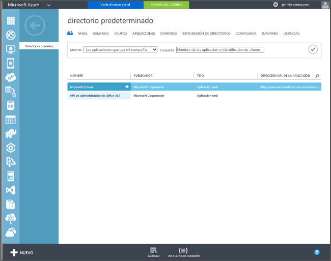

## Configuración de la inscripción automática de Windows 10 y Windows 10 Mobile con Azure Active Directory Premium

Con la inscripción automática, los usuarios pueden inscribir en Intune equipos Windows 10 corporativos o personales y dispositivos Windows 10 Mobile agregando una cuenta profesional o educativa y aceptando su administración. Así de fácil. En segundo plano, el dispositivo del usuario se registra y se une a Azure Active Directory. Una vez registrado, el dispositivo se administra con Intune.

**Requisitos previos**
- Suscripción a Azure Active Directory Premium ([suscripción de prueba](http://go.microsoft.com/fwlink/?LinkID=816845))
- Suscripción a Microsoft Intune

### Configurar la inscripción automática de MDM

1. En el [portal de administración de Azure](https://manage.windowsazure.com) (https://manage.windowsazure.com), vaya al nodo **Active Directory** y seleccione su directorio.

2. Seleccione la pestaña **Aplicaciones**. **Microsoft Intune** aparece en la lista de aplicaciones.

    

3. Seleccione la flecha para **Microsoft Intune**. Verá una página que le permite configurar Microsoft Intune.

4. Haga clic en **Configurar** para empezar a configurar la inscripción automática de MDM con Microsoft Intune.

5. Use los valores predeterminados para las siguientes direcciones URL:

  - **Inscripción de MDM**
  - **Condiciones de uso de MDM** 
  - **Cumplimiento de MDM**

6.  Especifique los dispositivos de los usuarios que se deben administrar mediante Microsoft Intune. Los dispositivos Windows 10 de estos usuarios se inscribirán automáticamente para la administración con Microsoft Intune.

  - **Todos**
  - **Grupos**
  - **Ninguno**

7. Elija **Guardar**.
