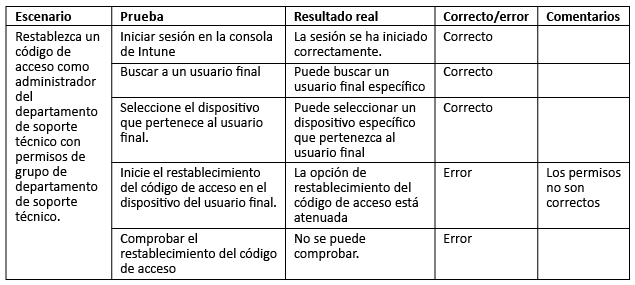

# Pruebas y validación de Intune

[!INCLUDE[note for both-portals](../includes/note-for-both-portals.md)]

La fase de prueba debe realizarse durante y después de la fase de implementación, necesitará tener cuentas, grupos y dispositivos de prueba para probar todos los escenarios de usuario final (caso de uso) y de TI (administración) requeridos que se identificaron anteriormente.

Se recomienda incorporar a su personal del departamento de soporte técnico de TI en la fase de pruebas, de forma que se cree documentación de soporte técnico y que el personal del departamento de soporte técnico de TI se encuentre cómodo proporcionando ayuda del producto. Si un componente o un escenario no funciona basándose en los casos de uso, asegúrese de documentar los cambios necesarios e incluir la razón por la que se realizó el cambio.

## Antes de comenzar

Se recomienda documentar lo siguiente:

-   **Criterios de prueba:** identifican los bancos de pruebas que se van a medir en función de estos.

-   **Componentes de diseño:** deben existir en al menos un criterio de prueba.

Si un componente de diseño no existe en al menos un criterio de prueba que se adapta a un requisito o escenario, considere si este se necesita o no. Además, asegúrese de tener los siguientes elementos:

-   **Cuentas:** las cuentas que se usan en las pruebas deben ser cuentas de prueba que tienen una licencia de EMS y Office 365 para probar todos los escenarios de casos de uso.

-   **Dispositivos:** los dispositivos que se usan en este punto deben ser dispositivos de prueba que pueden borrarse o restablecerse potencialmente a los valores predeterminados de fábrica.

-   **Componentes de integración:** todos los componentes de integración (conector de certificado, conector de servicio a servicio de Intune para Exchange hospedado, e Intune Exchange Connector local) deben estar instalados y configurados en caso necesario.

Los cambios de diseño pueden ser necesarios para acomodar dificultades imprevistas. Además, todos los cambios de diseño deben estar completamente documentados con el motivo de cada cambio. Aquí se muestra un ejemplo para mostrar lo que puede ser un cambio:

-   Puede darse cuenta de que no cumple los requisitos del Servicio de inscripción de dispositivos de red (NDES), y también obtiene la información de que los perfiles de VPN y Wi-Fi pueden configurarse con una CA raíz que cumple los mismos requisitos sin una implementación de NDES.

Puede experimentar desafíos o problemas que requieran instrucciones técnicas, o una solución de problemas especializada durante el proceso de validación y pruebas. Se recomienda buscar ayuda a través de los canales de soporte técnico de Microsoft.

-   [Más información sobre cómo obtener soporte técnico de Intune](https://docs.microsoft.com/intune/troubleshoot/how-to-get-support-for-microsoft-intune)

-   [Sugerencias de solución de problemas generales para Microsoft Intune](https://docs.microsoft.com/intune/troubleshoot/general-troubleshooting-tips-for-microsoft-intune).

-   [Más información sobre cómo obtener soporte técnico para Microsoft Intune](https://docs.microsoft.com/intune/troubleshoot/how-to-get-support-for-microsoft-intune).

-   [Asistencia telefónica para Microsoft Intune](https://docs.microsoft.com/intune/troubleshoot/contact-assisted-phone-support-for-microsoft-intune)

## Pruebas de validación funcional

La validación funcional consiste en probar cada componente y configuración para determinar si está funcionando correctamente. En la tabla siguiente se muestra un ejemplo de prueba de validación.

## Pruebas de validación de casos de uso

Las pruebas de validación de casos de uso deben realizarse para comprobar que los escenarios están completos y son funcionales. Existen dos tipos de escenarios de casos de uso, la administración de TI y el usuario final.

### Administración de TI

Las pruebas de validación del administrador de TI deben realizarse para validar que la acción administrativa que se realizó en un dispositivo o usuario funciona correctamente. A continuación se muestra un ejemplo de un escenario de validación completo de la administración de TI.

### Usuario final

Las pruebas de validación del usuario final deben realizarse para validar que la experiencia del usuario final es como se esperaba y se presenta correctamente en todas las comunicaciones de usuarios. Es importante validar que la experiencia del usuario final es correcta, ya que un error en la validación puede provocar tasas de adopción más bajas y un volumen más alto de llamadas al departamento de soporte técnico.

## Pasos siguientes

Ahora que ha probado y validado sus escenarios de casos de uso y los escenarios funcionales de Intune, está listo para su implementación de producción de Intune. Para más información, vea [Recursos adicionales](additional-resources.md).

<!--HONumber=Dec16_HO5-->

