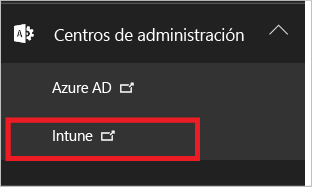
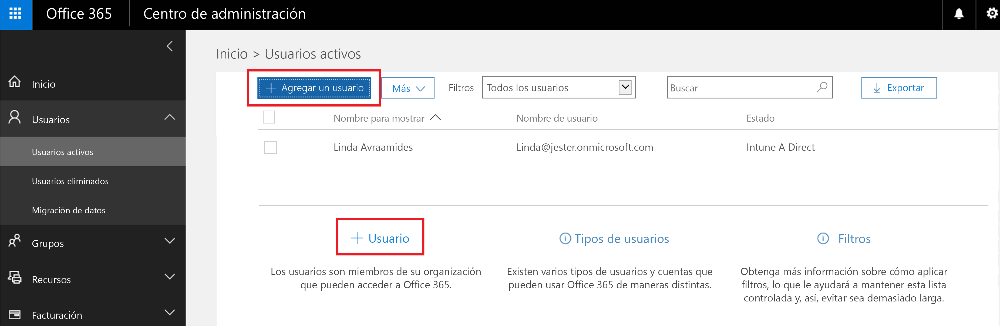
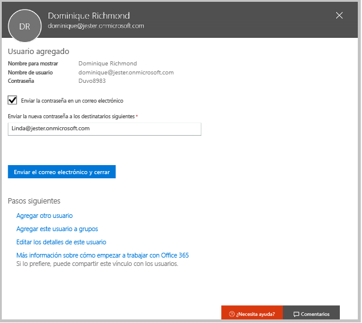
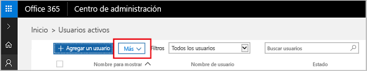

# Suscríbase para disfrutar de una prueba gratuita de Microsoft Intune
Este artículo le guiará a través de una suscripción para una evaluación de Intune y prepara la versión de prueba con algunos usuarios de modo que puede seguir la guía de evaluación asociada para ver cómo Intune administra los dispositivos móviles. <!---or app data when devices are not enrolled in Intune.--->

## Suposiciones
Este artículo de suscripción y la guía de evaluación presuponen que está utilizando la versión de prueba solo con fines de evaluación y va a comenzar con un entorno limpio al suscribirse.

Para facilitar la introducción a la versión de prueba, estamos configurando un entorno muy simple que usa solo Intune y presupone que será el único método de administración de dispositivos (conocido como la entidad de administración de dispositivos móviles). Sin embargo, a lo largo de la guía se indicará contenido técnico más profundo si desea explorar más adelante.

Puede hacer todo en el contenido de la versión de prueba que pueda hacer en una versión de suscripción; la única diferencia es que está limitado a 100 cuentas de usuario en la versión de prueba.

## Regístrese para obtener la versión de prueba
Visite la página [Registro de Intune](https://portal.office.com/Signup/Signup.aspx?OfferId=40BE278A-DFD1-470a-9EF7-9F2596EA7FF9&dl=INTUNE_A&ali=1#0%20) y rellene el formulario para suscribirse a una suscripción de prueba.

Si tiene una cuenta profesional o educativa y desea usarla para la versión de prueba de Intune, siga [estas instrucciones de inicio de sesión](https://docs.microsoft.com/en-us/intune/get-started/start-with-a-paid-subscription-to-microsoft-intune-step-1) en su lugar. Sin embargo, este artículo y las guías de evaluación suponen que no utiliza este tipo de cuenta.

> [!TIP]
> Si la mayoría de sus operaciones de TI y los usuarios están en una configuración regional diferente a usted, puede establecer esa configuración regional de la versión para probar el rendimiento.

### Consideraciones posteriores al registro
Si se registra para obtener una versión de prueba, recibirá un mensaje de correo electrónico con la información de la cuenta en la dirección de correo electrónico que haya proporcionado durante el proceso de suscripción. Este mensaje confirma que la versión de prueba está activa.

Después de completar el proceso de registro, se le dirigirá a una página que se usa para agregar usuarios y asignarles licencias a través del centro de administración de Office 365. La próxima vez que inicie sesión en Intune, irá automáticamente a la consola de administración de Intune.

## Mantener correctamente el centro de administración y la consola de administración de Intune
Hay dos portales que se van a utilizar para Intune: el centro de administración de Office 365 ([portal.office.com](https://portal.office.com)) y la consola de administración de Intune ([manage.microsoft.com](https://manage.microsoft.com)).

Normalmente, llevará a cabo su trabajo en la consola de administración de Intune que se muestra a continuación. Este es el sitio donde configurar y administrar grupos, directivas, dispositivos y aplicaciones.

Sin embargo, usará el centro de administración de Office 365, que aparece a continuación, para agregar y administrar los usuarios y otros aspectos de su cuenta, incluida la facturación y el soporte técnico.

Puede navegar desde el centro de administración de Office 365 a la consola de administración de Intune. Los centros de administración están en el último elemento en el panel de navegación izquierdo. Elija **Intune** para abrir la consola de administración de Intune en una nueva ficha.

Para volver de Intune al centro de administración de Office 365, elija la tarea **Agregar usuarios** en la página de información general de grupos.

## Agregar usuarios
Antes de abandonar el centro de administración de Office 365 para Intune, debe agregar algunos usuarios a su cuenta de prueba.

En el centro de administración de Office 365, puede agregar los usuarios individualmente o de forma masiva cargando un archivo .csv. Haremos ambas tareas para configurar la versión de prueba. Sin embargo, en el entorno de producción, probablemente deseará aprovechar las ventajas de las cuentas de usuario de Azure Active Directory, puede obtener más información en nuestra [Guía de inicio](https://docs.microsoft.com/en-us/intune/get-started/start-with-a-paid-subscription-to-microsoft-intune-step-3) y, en la sección [Pasos siguientes](#Next-steps) de este artículo.

### Adición de un usuario individual
1. Elija cualquiera de las opciones para agregar un uso y abrir un formulario que le permita crear un usuario. Solo los elementos marcados con un asterisco (\*) son obligatorios.

2.  Al agregar el usuario, el paso final será enviar al usuario un correo electrónico con su contraseña de Intune temporal. Para fines de esta evaluación, use su propia dirección de correo electrónico del trabajo, por lo que recibirá la información de inicio de sesión y verá el correo electrónico que recibirán los usuarios. A continuación, puede utilizar estas identidades de usuario para inscribir los dispositivos de prueba. 

 

3. Si desea asignar un rol de administrador a un usuario después de crearlo, puede editar el rol en el centro de administración de Office 365 seleccionando el nombre de usuario de la lista de usuarios y eligiendo **Editar** en la línea de rol para ver la lista de roles de usuario seleccionables y asignar uno a ese usuario.

 

### Importar varios usuarios
1. Encontrará el asistente para importar varios usuarios en la lista **Más**.

 

2. Para ayudarle a configurar correctamente el archivo .csv, puede descargar un archivo de plantilla que se rellenará con los datos de usuario. Descargue el archivo .csv que contiene los encabezados e información de usuario de ejemplo para ver exactamente el tipo de datos para cada campo.

 

3. Una vez que haya creado y guardado el archivo .csv, elija **Examinar** para seleccionar el archivo. Compruebe y elija **Siguiente**. Los usuarios se cargarán y agregarán a la lista de usuarios activos.

Ahora es el momento de dirigirse a la consola de administración de Intune para empezar a administrar los usuarios, sus dispositivos y sus aplicaciones.

> [!NOTE]
> Los usuarios no se mostrarán en Intune hasta que hayan inscrito un dispositivo para administrarlos.

## Pasos siguientes
Escenario de evaluación: [Evaluar la administración de dispositivos móviles en Microsoft Intune](mobile-device-management-trial-guide-microsoft-intune.md)

Obtenga más información sobre el uso de las cuentas de usuario de Azure Active Directory con Intune:
- [¿Requisitos de identidad?](https://docs.microsoft.com/en-us/active-directory/active-directory-hybrid-identity-design-considerations-overview#design-considerations-overview)
- [Requisitos de sincronización de directorios](https://docs.microsoft.com/en-us/active-directory/active-directory-hybrid-identity-design-considerations-directory-sync-requirements)
- [Requisitos de Multi-factor Authentication:](https://docs.microsoft.com/en-us/active-directory/active-directory-hybrid-identity-design-considerations-multifactor-auth-requirements)

Obtenga más información sobre [Intune con System Center Configuration Manager](https://docs.microsoft.com/en-us/sccm/mdm/understand/hybrid-mobile-device-management)

<!--HONumber=Dec16_HO2-->

