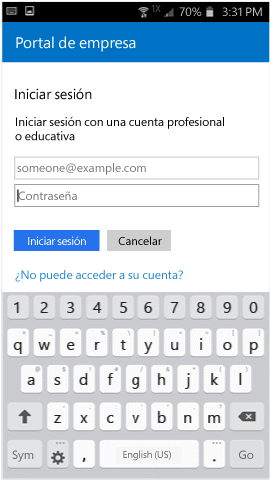

# Inscriba el dispositivo Android en Intune

Si su empresa o centro educativo usa Microsoft Intune, puede inscribir un dispositivo Android para obtener acceso al correo electrónico, a los archivos y a otros recursos de la empresa. Cuando los dispositivos se inscriben, el departamento de TI puede administrar esos recursos profesionales o educativos y mantenerlos protegidos, al tiempo que los usuarios pueden usar el dispositivo que elijan libremente para realizar su trabajo. Para obtener más información sobre la inscripción, vea [What happens if you install the Company Portal app and enroll your device in Intune?](what-happens-if-you-install-the-Company-Portal-app-and-enroll-your-device-in-intune-android.md) (¿Qué ocurre cuando se instala la aplicación de portal de empresa y se inscribe el dispositivo en Intune?).

> [!VIDEO https://channel9.msdn.com/Series/IntuneEnrollment/Android-Enrollment/player]

Estas instrucciones se aplican a dispositivos Android nativos y Samsung KNOX. Samsung KNOX es un tipo de seguridad que utilizan determinados dispositivos Samsung para proporcionar protección adicional fuera de lo que ofrece Android de forma nativa. Para comprobar si tiene un dispositivo Samsung KNOX, vaya a **Configuración** > **Acerca del dispositivo**. Si no ve "Versión KNOX" en la lista, significa que el suyo es un dispositivo Android nativo.

Antes o después de la inscripción, se le pedirá que elija una categoría que describa de la mejor forma posible cómo usar el dispositivo. El administrador de TI usa esta categoría para comprobar las aplicaciones a las que se tienen acceso.

Si recibe un error al intentar inscribir el dispositivo en Intune, puede [enviar errores de inscripción a su administrador de TI](send-enrollment-errors-to-your-it-admin-android.md).

**Para inscribir su dispositivo Android:**

1.  Instale la aplicación gratuita de portal de empresa de Intune desde [Google Play](http://play.google.com/store/apps/details?id=com.microsoft.windowsintune.companyportal).

2.  Abra la aplicación de portal de empresa de Microsoft Intune.

3.  En la pantalla de **inicio de sesión** del Portal de empresa, pulse **Iniciar sesión** y luego inicie sesión con su cuenta profesional o educativa.

       

4.  Si el administrador de TI configuró los términos y condiciones, pulse **ACEPTAR** para aceptar los términos. Esta pantalla puede diferir ligeramente de la imagen siguiente según la versión de Android que use actualmente.

    

5.  Inicie sesión en la aplicación de portal de empresa con su cuenta profesional o educativa y contraseña correspondiente y, luego, pulse en **Iniciar sesión**.

    

6.  En la pantalla **Configuración de acceso a la empresa**, pulse **COMENZAR**.

    

    > [!NOTE]
    > Los triángulos amarillos no significan que ya haya un error. Estos iconos indican que todavía hay pasos del proceso de inscripción que deben completarse.

7. En la pantalla **¿Por qué inscribir el dispositivo?**, lea lo que puede hacer si inscribe el dispositivo y, luego, pulse en **Continuar**.

    

8.  Revise una lista sobre lo que el administrador de TI puede y no puede ver en el dispositivo y pulse **CONTINUAR**.

    

9.  En la pantalla **Lo que viene después**, lea lo que sucede durante la inscripción y después pulse **INSCRIBIR**.

    

10.  Si usa Android 6.0 o posterior, realice este paso. De lo contrario, vaya al próximo paso.

    Si el administrador de TI ha configurado algunas directivas, puede que aparezcan los siguientes mensajes:
    -   **¿Permitir que el Portal de empresa realice y administre llamadas telefónicas?**

        

    Si ve este mensaje, pulse en **PERMITIR**. Pulsar PERMITIR no entraña riesgos, puesto que **Microsoft nunca realiza ni controla sus llamadas de teléfono**. Google es responsable del texto del mensaje, que Microsoft no puede modificar. Al permitir el acceso, lo que está haciendo es dejar que el dispositivo envíe el número de identidad de equipos de estación móvil internacional (IMEI) del dispositivo a Intune. El IMEI es un número similar a un número de serie que identifica de forma exclusiva a un dispositivo móvil.

    Si se deniega el acceso, el mensaje aparecerá de nuevo la próxima vez que inicie sesión en el Portal de empresa, pero puede desactivar los mensajes futuros si pulsa en la casilla **No volver a preguntar**. Si más adelante decide permitir el acceso, vaya a **Configuración** &gt; **Aplicaciones** &gt; **Portal de empresa** &gt; **Permisos** &gt; **Teléfono**y active el permiso.

    -   **Allow Company Portal to access your contacts?** (¿Permitir que el Portal de empresa tenga acceso a los contactos?)

        

        Si ve este mensaje, pulse en **PERMITIR**. Pulsar PERMITIR no entraña riesgos, puesto que **Microsoft nunca tiene acceso a sus contactos**. Google es responsable del texto del mensaje, que Microsoft no puede modificar. Cuando permite el acceso, solo permite que la aplicación del Portal de empresa cree, use y administre su cuenta profesional.

        Si se deniega el acceso, el mensaje aparecerá de nuevo la próxima vez que inicie sesión en el Portal de empresa, pero puede desactivar los mensajes futuros si pulsa en la casilla **No volver a preguntar**. Si más adelante decide permitir el acceso, vaya a **Configuración** &gt; **Aplicaciones** &gt; **Portal de empresa** &gt; **Permisos** &gt; **Teléfono**y active el permiso.

11.  En la pantalla **Activar administrador del dispositivo**, pulse **Activar**.

    

    El rol de administrador del dispositivo es en el que el Portal de la empresa debe administrar su dispositivo. Permite al administrador ver ciertas cosas, como cuántas veces ha intentado desbloquear la pantalla, y tomar algunas medidas.

    Lo que debe recordar es que se trata de acciones que se realizan en el nombre de la seguridad. El administrador de TI no está intentando invadir su privacidad o borrar la información sin motivo, sino que desea asegurarse de que los datos corporativos se mantengan a salvo.

    Microsoft no controla este mensaje, y somos conscientes de que su redacción puede parecer un poco drástica. No hay una forma de que el Portal de empresa muestre solo las restricciones y el acceso que son relevantes para su organización. Todos ellos aparecen a la vez en esta pantalla. Póngase en contacto con el administrador de TI para obtener más información, usando la información de contacto que aparece en el [sitio web del Portal de empresa](http://portal.manage.microsoft.com), si tiene preguntas específicas sobre el uso de su organización.

12.  Siga las instrucciones para escribir un PIN o contraseña. Si ya ha configurado un PIN o una contraseña en este dispositivo, no verá esta pantalla y no deberá escribir un PIN o contraseña nueva.

    

13.  Si usa un dispositivo Samsung KNOX, pulse **Confirmar** y verá un mensaje que indica que el dispositivo se está inscribiendo. Si usa un dispositivo Android nativo, solo verá la pantalla siguiente, que muestra que el dispositivo se está inscribiendo.

    

    En esta pantalla se muestra que el dispositivo se está inscribiendo.

    

14. Cuando aparezca la pantalla **Configuración de acceso de la compañía**, pulse **CONTINUAR**. Si un mensaje indica que el dispositivo es incompatible, siga las instrucciones para solucionar el problema y luego pulse **CONTINUAR**.

    

    

    Puede encontrar más información sobre los problemas tocándolos.

    

      

15. En la pantalla **Configuración de acceso de la compañía completada**, pulse **LISTO**. El dispositivo ya está inscrito.

    

Antes de intentar instalar aplicaciones de empresa, vaya a **Ajustes** &gt; **Seguridad** y active **Fuentes desconocidas**. Si no activa esta opción antes de intentar instalar aplicaciones, verá el mensaje siguiente: "Instalación bloqueada. Por motivos de seguridad, el dispositivo está configurado para bloquear las instalaciones de aplicaciones procedentes de orígenes desconocidos". Puede pulsar **Configuración** en el cuadro de diálogo del error para ir a la opción **Orígenes desconocidos**.

> [!Note]
> Si su organización usa software de administración de gastos de telecomunicaciones, deberá completar algunos pasos adicionales antes de que el dispositivo esté completamente inscrito. Descubra más [aquí](enroll-your-device-with-telecom-expense-management-android.md).

¿Sigue necesitando ayuda? Póngase en contacto con el administrador de TI (visite el [sitio web del Portal de empresa](http://portal.manage.microsoft.com) para obtener la información de contacto), o escriba al <a href="mailto:wintunedroidfbk@microsoft.com?subject=I'm having trouble with enrolling my Android device&body=Describe the issue you're experiencing here.">equipo de Microsoft Android</a>.
