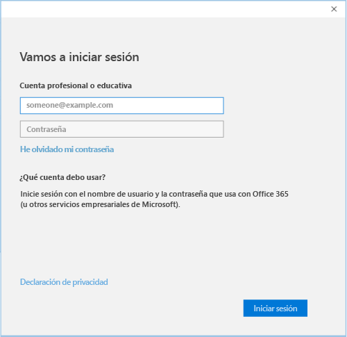

# Inscribir un dispositivo Windows 10 en Intune

  > [!NOTE]
  > Windows 10 funciona en dispositivos de todo tipo. Tanto si usa un dispositivo de escritorio como un teléfono o una tableta, los pasos que debe seguir son los mismos, aunque puede que presenten pequeñas diferencias respecto a las imágenes que se muestran en esta página.

1.  Vaya a **Inicio**.

  - Si está usando un dispositivo con **una versión de escritorio de Windows 10**, vaya al **menú Inicio**.
  - Si está usando un dispositivo con **Windows 10 Mobile**, vaya al **menú Inicio** y, después, deslice el dedo para ir a la lista **Todas las aplicaciones**.

2. Abra la aplicación **Configuración** de Windows buscando "configuración" en la barra de búsqueda.

3. Seleccione **Cuentas**.

    

4. Seleccione **Su cuenta**.

    

5. Seleccione **Agregar una cuenta profesional o educativa**.

    

6. Inicie sesión con las credenciales de su trabajo o escuela.

    

¿Sigue sin poder acceder a su correo electrónico, archivos u otros datos profesionales o educativos? Para corregirlo, [solucione los problemas relacionados con su cuenta](troubleshoot-your-windows-10-device-windows.md#troubleshooting-steps-to-follow-if-you-see-your-account). Si sigue sin tener acceso, deberá ponerse en contacto con el equipo de soporte técnico de su empresa para obtener más ayuda.

Puede obtener ayuda del equipo de soporte técnico de su empresa fácilmente a través de la información de contacto incluida en la aplicación de Portal de empresa. Esta aplicación también le permite buscar y descargar otras aplicaciones recomendadas y necesarias para el trabajo diario. Es posible que ya tenga la aplicación de portal de empresa instalada en el dispositivo. Una manera sencilla de comprobarlo consiste en buscar __Portal de empresa__ en la lista __Todas las aplicaciones__.

Si no ve el Portal de empresa en su lista de aplicaciones, siga estos pasos para instalarlo.

1. Seleccione **Iniciar** > **Tienda**.

2. Seleccione **Buscar** y luego escriba **portal de empresa**.

3. En la lista de resultados, seleccione **Portal de empresa** > **Instalar**.

4. Seleccione **Instalar** o **Gratis**. No hay ninguna diferencia entre estas dos opciones. La opción que se muestra depende de la manera en que su organización configuró la aplicación de portal de empresa.
