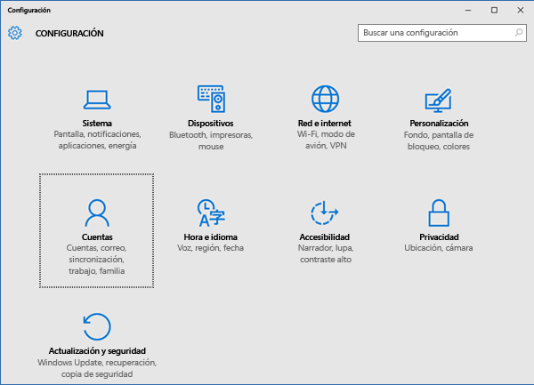
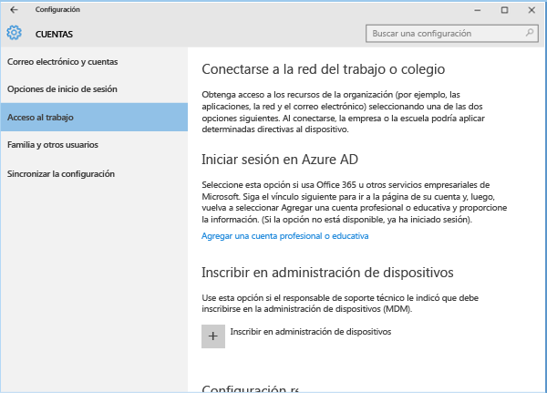
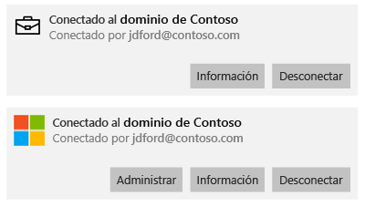
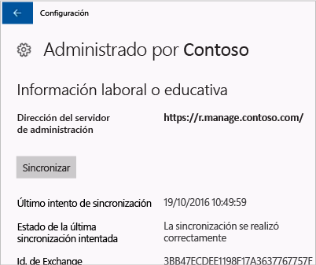
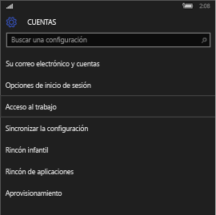
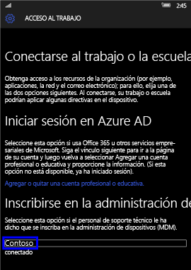
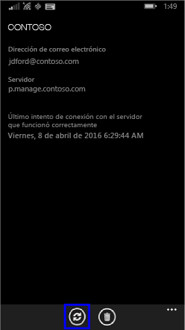

# Sincronización manual del dispositivo Windows

A veces, intentar instalar una aplicación en su dispositivo Windows puede tardar más de lo que esperaba. Si esto sucede, puede intentar sincronizar manualmente su dispositivo Windows. La sincronización puede ayudar a acelerar la instalación.

> [!Note]
> Las aplicaciones pueden tardar un tiempo en instalarse si está en una red con velocidades más lentas o grandes cantidades de dispositivos descargando contenido a la vez.

Las siguientes versiones de Windows pueden sincronizarse manualmente. Si su dispositivo está usando una versión diferente de Windows, no puede iniciar una sincronización manual.

* [Sincronizar Windows 10 Escritorio](#windows-10-desktop)
* [Sincronizar Windows 10 Mobile](#windows-10-mobile)
* [Sincronizar Windows Phone 8.1](#windows-phone-81)

## Windows 10 Escritorio
Hay más de una versión de Windows 10, así que hay dos conjuntos de pasos. Para averiguar qué pasos debe seguir, vea las capturas de pantalla y siga los pasos que se parezcan a lo que ve en el dispositivo.

1. Elija el botón **Iniciar** y, después, elija **Configuración**.

    

2. En la página **Configuración**, seleccione **Cuentas**.

    

3. Examine las dos pantallas siguientes y elija la que se parezca más a lo que ve en el dispositivo. Siga los pasos que tienen que ver con la pantalla que verá en el dispositivo.

    Si aparece esta pantalla, que muestra "Obtener acceso a trabajo o escuela", siga las instrucciones de [Pasos a seguir si ve acceso profesional o educativo](#steps-to-follow-if-you-see-access-work-or-school).

    

    Si aparece esta pantalla, que muestra "Acceso al trabajo", siga los pasos de [Pasos que debe seguir si ve acceso profesional](#steps-to-follow-if-you-see-work-access).

    

### Pasos a seguir si ve acceso profesional o educativo

1. En la página **Cuentas**, elija **Obtener acceso a trabajo o escuela**.

    

2. Elija la cuenta profesional o educativa. Según la configuración que haya definido el equipo de soporte técnico de su empresa, podría ver dos cuentas con un aspecto similar al ejemplo siguiente. Una tiene un maletín al lado y la otra tiene el logotipo de Microsoft.

    - Si ve la cuenta con el maletín, selecciónela y busque un botón **Información** debajo de ella.
    - Si solo ve la cuenta con el logotipo de Microsoft, selecciónela y busque un botón **Información** debajo de ella.

    

3. Elija el botón **Información**. Se abre un cuadro de diálogo parecido al siguiente ejemplo.

    

4. Elija el botón **Sincronizar**. El dispositivo se sincronizará con Intune.

### Pasos que debe seguir si ve acceso profesional

1. En la página **Cuentas**, seleccione **Acceso al trabajo**.

    

2. En la sección **Enroll in to device management** (Inscribirse en la administración de dispositivos), elija el nombre de su compañía.

    

3. Elija el botón **Sincronizar**.

    

   El botón se atenúa hasta que se finaliza la sincronización.

### Windows 10 Mobile
Para sincronizar manualmente el dispositivo de Windows 10 Mobile de modo que se acelere la instalación de una aplicación lenta:

   1. Vaya a **Todas las aplicaciones** > **Configuración** > **Cuentas**.

       

   2. Elija **Acceso al trabajo**.

       

   3. En **Enroll in to device management** (Inscribirse en la administración de dispositivos), elija el nombre de su empresa.

       

   4. Elija el icono **Sincronizar**.

       

       Aparece el mensaje "We’re synching your account" (Estamos sincronizando su cuenta) en la parte superior de la pantalla. El botón **Sincronizar** aparecerá atenuado hasta que el dispositivo finalice la sincronización.

## Windows Phone 8,1
Para sincronizar manualmente el dispositivo de Windows Phone 8.1 de modo que se acelere la instalación de una aplicación lenta:

1. Vaya a **Todas las aplicaciones** > **Configuración** > **Área de trabajo**.

    

2. Elija el nombre de su compañía.

    

3. Elija el icono **Sincronizar**.

    

   Aparece el mensaje "We’re synching your account" (Estamos sincronizando su cuenta) en la parte superior de la pantalla hasta que el dispositivo acabe de sincronizarse.

¿Sigue necesitando ayuda? Póngase en contacto con el departamento de soporte técnico de la empresa. Para averiguar su información de contacto, vaya al [sitio web del portal de empresa](https://portal.manage.microsoft.com#HelpDeskDialog).
