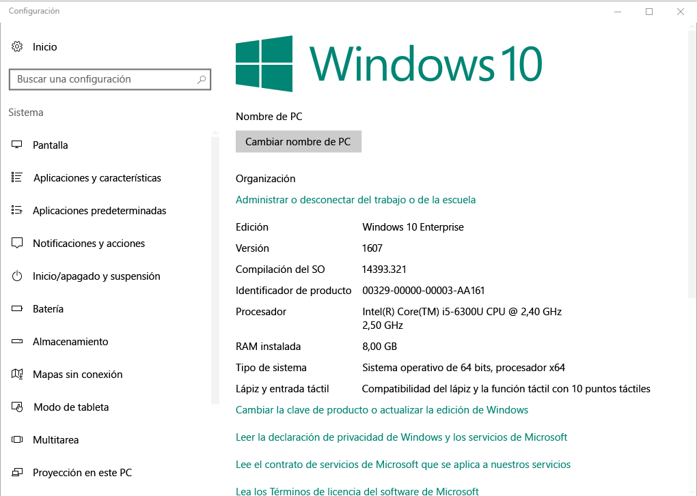

# Inscripción de dispositivos de Windows en el Portal de empresa de Intune  

Inscribir el dispositivo de Windows en la aplicación de Portal de empresa de Intune para obtener acceso seguro al trabajo y aplicaciones de la escuela, correos electrónicos y archivos. Si su organización necesita o recomienda determinadas aplicaciones, como Office o OneDrive, o bien recibirá ellos durante la inscripción o estarán disponibles en el Portal de empresa después de la inscripción.  

Puede inscribir dispositivos Windows 10 a través del sitio Web del Portal de empresa *o* app. Si va a inscribir un dispositivo con una versión anterior de Windows, debe inscribir el dispositivo a través del sitio Web del Portal de empresa.  

## Aplicación de Portal de empresa de la instalación  
Puede que ya tenga la aplicación de Portal de empresa instalada en el dispositivo. Busque la aplicación en su __todas las aplicaciones__ lista.  Si no ve el Portal de empresa en la lista de aplicaciones, siga estos pasos para instalarlo.  

1. Abra **Microsoft Store** en el dispositivo.

2. En el **búsqueda** , escriba **Portal de empresa**.

3. En la lista de resultados, seleccione **Portal de empresa** > **Instalar**.

4. Seleccione **Instalar** o **Gratis**. No hay ninguna diferencia entre estas dos opciones. las palabras aparezcan en función de cómo establece la organización de la aplicación.  

## Buscar el número de versión de Windows 10  
Los pasos de inscripción son diferentes para distintas versiones de los dispositivos Windows 10. Los pasos siguientes describen cómo encontrar el número de versión de Windows 10 escritorio y dispositivos móviles. Una vez que conozca su versión, continúe con los pasos de inscripción recomendados.  

### Dispositivos con Windows 10 Escritorio  

1. Vaya a **Inicio**.

2. En la barra de búsqueda, escriba la frase "acerca de"tu PC. Seleccione __acerca de tu PC__ en los resultados.  

     

3. Desplácese hacia abajo hasta **especificaciones Windows** para encontrar el **versión** de Windows 10 que está instalado en su PC.  

     

4. Si su versión es  

    *  __1607 o posterior__: inscribir el dispositivo por medio de la [ **configuración** > **cuenta** > **acceso profesional o educativo**ruta](enroll-windows-10-device.md#enroll-windows-10-version-1607-and-later-device).   
    * __1511 o versiones anteriores__: inscribir el dispositivo por medio de la [ **configuración** > **cuenta** > **sus cuentas** ruta](enroll-windows-10-device.md#enroll-windows-10-version-1511-and-earlier-device).  

### Dispositivos Windows 10 Mobile       

1.  Vaya a __todas las aplicaciones__ y seleccione el __configuración__ app.  
2.  Seleccione __Sistema__ > __Acerca de__.      
3.  En __información del dispositivo__, busque el __versión__.  
4. Si su versión es  

    *  __1607 o posterior__: inscribir su dispositivo mediante el [ **configuración** > **acceso profesional o educativo** ruta](enroll-windows-10-device.md#enroll-windows-10-version-1607-and-later-device).   
    * __1511 o versiones anteriores__: inscribir su dispositivo mediante el [ **configuración** > **cuentas** ruta](enroll-windows-10-device.md#enroll-windows-10-version-1511-and-earlier-device).  

## Inscribir dispositivos que no sean Windows 10  
Use los siguientes artículos para inscribir los demás dispositivos compatibles de Windows a través del sitio Web del Portal de empresa:   
* [Dispositivo Windows 8.1 o Windows RT 8.1](enroll-your-W81-or-rt81-windows.md)  
* [Dispositivo Windows Phone 8.1](enroll-your-wp81-windows.md)    

## Pasos siguientes  
Ahora que conoce los dispositivos compatibles y el número de versión de Windows 10, continúe con el artículo de inscripción recomendados.  
 
Para obtener más información acerca de la administración de dispositivos, Portal de empresa y cómo se utilizan en las escuelas y en el trabajo, consulte los artículos siguientes:  
* [Uso de dispositivos administrados para acceder a recursos de trabajo o educativos](use-managed-devices-to-get-work-done.md)  
* [¿Qué ocurre si instala la aplicación de Portal de empresa e inscribe el dispositivo Windows en Intune?](what-happens-if-you-install-the-company-portal-app-and-enroll-your-device-in-intune-windows.md)  
* [¿Qué información puede ver mi organización cuando inscribo mi dispositivo?](what-info-can-your-company-see-when-you-enroll-your-device-in-intune.md)  

¿Necesita ayuda? Póngase en contacto con el departamento de soporte técnico de la empresa. [Vaya al sitio Web de Portal de empresa](https://go.microsoft.com/fwlink/?linkid=2010980) para encontrar su organización TI información de contacto.  
