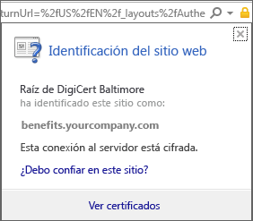
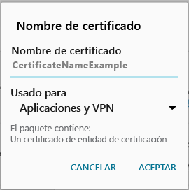

# El dispositivo Android no tiene un certificado que necesita el administrador de TI

Si el dispositivo no está inscrito en Intune y no tiene un certificado determinado que necesita el administrador de TI, no podrá iniciar sesión en la aplicación de portal de empresa. Cuando intente iniciar sesión, verá el siguiente mensaje:

Para resolver este problema y obtener el certificado necesario, hay dos pasos principales que necesitará realizar:

- Identificar el certificado que falta mirando en el equipo de una empresa o escuela.
- Usar el dispositivo para descargar el certificado que falta desde Internet.

## Identificar el certificado que falta mirando en el equipo de una empresa o escuela

1. Abra un equipo y, luego, Internet Explorer. Si no tiene un equipo para esto, póngase en contacto con el administrador de TI. Para encontrar la información de contacto del administrador de TI, vaya al [sitio web del portal de empresa](http://portal.manage.microsoft.com).

2. Vaya al [sitio web del portal de empresa](http://portal.manage.microsoft.com) e inicie sesión con sus credenciales profesionales o educativas.

3. A la derecha de la barra de direcciones del explorador, elija el símbolo que parece un candado como se muestra en la siguiente captura de pantalla.

    

    Si no ve el símbolo del candado, deténgase y póngase en contacto con el administrador de TI. El candado significa que la sesión iniciada es segura, por lo que no debe continuar a menos que vea dicho símbolo.

4. Elija **Ver certificados**.

    

5. En el cuadro de diálogo **Certificado**, elija la pestaña **Ruta de certificación** y, luego, identifique el certificado que tiene que obtener desde Internet. El nombre del certificado que necesita estará en la misma posición que el que está resaltado en la captura de pantalla del ejemplo anterior.

## Descargar e instalar el certificado que falta en el dispositivo móvil Android

1. Con un motor de búsqueda como Bing o Google, busque el nombre del certificado que falta que identificó en la sección anterior. El certificado puede terminar con diferentes "extensiones", como ".crt", ".pem", etc.

2. Descargue el certificado raíz desde el sitio web.

3. Una vez que descargue el certificado, arrastre hacia abajo desde la parte superior del dispositivo para abrir las notificaciones y luego pulse el nombre del certificado en la lista de notificaciones.

4. En el cuadro de diálogo **Nombre del certificado** que se muestra en la siguiente captura de pantalla, acepte el nombre de certificado predeterminado.

5. Asegúrese de que **Uso de credencial** está configurado como **Usada para VPN y aplicaciones** y pulse en **Aceptar**.

    

6. Cierre la aplicación del portal de empresa.

7. Vuelva a abrir la aplicación del portal de empresa. Ahora debería poder iniciar sesión en la aplicación Portal de empresa. Si necesita ayuda, póngase en contacto con el administrador de TI.

Si aparece el mismo mensaje que indica que "falta un certificado" como el que se ha mostrado anteriormente, y ya ha seguido el procedimiento, probablemente todavía haya otro certificado que el administrador de TI necesitará ayudarle a instalar. Póngase en contacto con el administrador de TI para obtener ayuda con la información de contacto disponible en el [sitio web del portal de empresa](http://portal.manage.microsoft.com).

